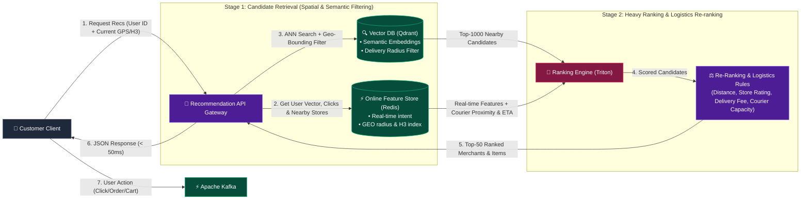
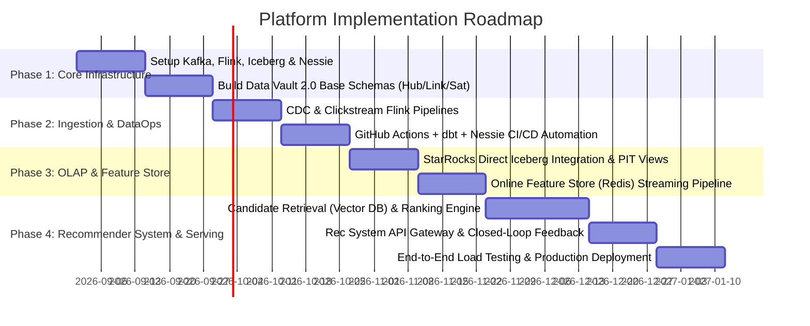

# TECHNICAL PROPOSAL: REAL-TIME STREAMING LAKEHOUSE WITH DATA VAULT 2.0, GIT-LIKE DATAOPS & END-TO-END RECOMMENDER SYSTEM

**Author:** ValoStream Engineering Team  
**Role:** Senior Data & AI Platform Architect  
**Status:** Proposal / Ready for Implementation  
**Target Architecture:** Enterprise Real-Time Data Lakehouse & AI/ML Recommendation Platform  

---

## 1. Context & Business Problem

As large-scale enterprise systems scale, traditional Data Platforms (built on Batch Processing + Star Schema) encounter 4 major bottlenecks:

1. **High Latency & Dirty Data on Production:** Batch ETL pipelines delay BI reports and AI models by hours or days. Simultaneously, the lack of an isolated staging/testing environment risks leaking "dirty data" into production when deploying new code or pipelines.
2. **Brittle Schema Evolution:** Source data schemas (E-commerce, Clickstream, CDC) evolve continuously. Traditional Dimensional Modeling (Kimball) requires altering Fact/Dimension tables, creating significant risks of pipeline downtime.
3. **Lack of Data Versioning:** No Git-like version control mechanism (Branch / Merge / Rollback) exists for data, making automated Data Quality Testing, A/B Testing, or instant disaster recovery during ingestion failures impossible.
4. **Gap Between Data Warehouse and Real-Time AI / Recommender Systems:** Data serving personalized user recommendations is fragmented. There is no unified Feature Store synchronizing real-time streaming features with historical batch Data Vault features, resulting in elevated latency for end-user serving (<50ms SLA).

---

## 2. Proposed Solution

Build a modern **Real-Time Streaming Lakehouse Platform** powered by **Streaming Data Vault 2.0** methodology, integrated with the next-generation Lakehouse ecosystem (**Apache Iceberg + Apache Nessie**), **DataOps (CI/CD for Data)** automation via GitHub Actions, and an **End-to-End Real-Time Recommender System** for personalized user serving.

### Key Architecture Stack:
* **Ingestion & Streaming:** Apache Kafka + Apache Flink (Real-time Hash Key $MD5$, HashDiff & Data Vault Transformations).
* **Storage & Governance:** Apache Iceberg + Apache Nessie (Git-like Data Catalog, Zero-Copy Branching).
* **Serving & Query Acceleration:** StarRocks (Sub-second vectorized OLAP on PIT/Bridge Views).
* **Feature Store & Real-Time ML:** Redis (Online Feature Store) + Iceberg (Offline Feature Store).
* **Recommender System Engine:** Qdrant (Vector DB) + Two-Stage Ranking Engine (Triton Inference Server) + Closed-Loop Feedback Stream.
* **Geospatial Analytics & Visualization:** Apache Sedona (Flink Geospatial Engine) + H3 Indexing (Uber Hexagonal Spatial Index) + Deck.gl / Kepler.gl (Sub-second Hexagon Heatmap Visualization).
* **DataOps & Quality Gate:** GitHub Actions + dbt Core (Automated testing & merging on isolated Nessie branches).

---

## 3. High-Level Architecture

### 3.1 End-to-End Data & ML Flow Diagram

```mermaid
flowchart TD
    %% Styling Classes
    classDef domain fill:#1f2937,stroke:#4b5563,color:#fff,stroke-width:2px;
    classDef ingest fill:#1e3a8a,stroke:#3b82f6,color:#fff,stroke-width:2px;
    classDef vault fill:#065f46,stroke:#10b981,color:#fff,stroke-width:2px;
    classDef lakehouse fill:#3730a3,stroke:#6366f1,color:#fff,stroke-width:2px;
    classDef cicd fill:#831843,stroke:#ec4899,color:#fff,stroke-width:2px;
    classDef serving fill:#7c2d12,stroke:#f97316,color:#fff,stroke-width:2px;
    classDef recsys fill:#581c87,stroke:#a855f7,color:#fff,stroke-width:2px;
    classDef spatial fill:#0f766e,stroke:#14b8a6,color:#fff,stroke-width:2px;

    %% 1. Multi-Domain Data Sources (Delivery, GIS & Clickstream)
    subgraph DOMAINS["🌐 Multi-Domain Data Sources (Delivery, GIS & Clickstream)"]
        direction TB
        D1["<b>Transactional CDC</b><br/>Debezium MySQL/PG<br/><i>Orders, Payments, Merchants</i>"]:::domain
        D2["<b>User Clickstream Events</b><br/>Customer Mobile/Web SDK<br/><i>Views, Clicks, Searches, Cart</i>"]:::domain
        D3["<b>Courier GPS Telemetry</b><br/>Driver App IoT Stream<br/><i>Live Coordinates (lat/lon), Speed, ETA</i>"]:::domain
    end

    %% 2. Ingestion & Streaming Layer
    subgraph INGESTION["⚡ Real-Time Ingestion & Streaming Layer"]
        KAFKA["<b>Apache Kafka</b><br/>Distributed Event Bus<br/><i>(events.clickstream, events.telemetry, cdc.orders)</i>"]:::ingest
        FLINK["<b>Apache Flink & PyFlink</b><br/>• Real-Time Hash MD5 & HashDiff<br/>• Stream Deduplication & Load Date<br/>• Uber H3 Spatial Indexing (res7, res9)<br/>• GeoParquet WKB & Feature Extraction"]:::ingest
    end

    %% 2.5 Real-Time Streaming Storage Buffer (Fluss)
    subgraph FLUSS_TIER["⚡ Real-Time Streaming Storage Tier (Apache Fluss)"]
        direction TB
        FLUSS_PK["<b>Fluss Updatable PK Table</b><br/>courier_telemetry_live<br/><i>(Sub-second mutable state)</i>"]:::ingest
        FLUSS_LOG["<b>Fluss Real-Time Append Log</b><br/>clickstream_realtime_log<br/><i>(Streaming buffer)</i>"]:::ingest
    end

    %% 3. Medallion Lakehouse Storage (Iceberg + Nessie + S3)
    subgraph MEDALLION["🏛️ Medallion Lakehouse Storage (Apache Iceberg via Nessie Catalog)"]
        direction TB

        subgraph BRONZE["🥉 Bronze Tier (Raw & Immutable Append Log)"]
            B_CLICK["raw_clickstream"]
            B_TELEM["raw_telemetry"]
            B_CDC["raw_orders_cdc"]
        end

        subgraph SILVER["🥈 Silver Tier (Streaming Data Vault 2.0 Core)"]
            direction TB
            subgraph HUBS["Hub Tables (Core Entities)"]
                H_USER["Hub_User"]
                H_ITEM["Hub_Item"]
                H_MERCHANT["Hub_Merchant"]
                H_COURIER["Hub_Courier"]
                H_ORDER["Hub_Order"]
            end
            subgraph LINKS["Link Tables (Interactions & Logistics)"]
                L_INTERACTION["Link_User_Item_Interaction"]
                L_DELIVERY["Link_Delivery_Trip"]
            end
            subgraph SATS["Satellite Tables (Context, State & Spatial)"]
                S_USER_PROF["Sat_User_Profile"]
                S_MERCHANT_LOC["Sat_Merchant_Location"]
                S_INTERACTION["Sat_Interaction_Context_Spatial"]
                S_COURIER_LOC["Sat_Courier_Telemetry_Spatial"]
            end
        end

        subgraph GOLD["🥇 Gold Tier (Information Marts & Serving Views)"]
            G_DIM["Dimensions: dim_merchants, dim_users, dim_couriers"]
            G_FCT["Spatial Facts: fct_daily_orders_spatial"]
            G_H3["Spatial Hexagon Mart: mart_h3_demand_hourly"]
            G_FEAT["Feature Mart: mart_user_merchant_affinity"]
        end
    end
    class MEDALLION,BRONZE,SILVER,GOLD,HUBS,LINKS,SATS vault;

    %% 4. Governance & Versioning
    subgraph GOVERNANCE["🔒 Data Governance & Catalog"]
        NESSIE{"<b>Apache Nessie Server</b><br/>Git-like Iceberg REST Catalog<br/><i>(Main & Zero-Copy Branches)</i>"}:::lakehouse
        STORAGE_S3[("<b>Object Storage</b><br/>MinIO (dev) / AWS S3 (prod)<br/><i>(Iceberg Parquet / GeoParquet)</i>")]:::lakehouse
    end

    %% 5. Batch Compute, DataOps & Orchestration
    subgraph COMPUTE_BATCH["⚙️ Batch Compute, DataOps & Orchestration"]
        AIRFLOW["<b>Apache Airflow</b><br/>DAG Orchestration & Maintenance Scheduler"]:::cicd
        DBT["<b>dbt Core + StarRocks</b><br/>Silver ➔ Gold SQL Transformations & Quality Gates"]:::cicd
        SPARK["<b>Apache Spark (PySpark) + Jupyter</b><br/>• Batch Feature Engineering<br/>• Two-Tower / DCNv2 Offline Training<br/>• Batch Item Embeddings Generation"]:::ingest
    end

    %% 6. OLAP Serving & Spatial Analytics Layer
    subgraph SERVING["🚀 Serving & Spatial Analytics Layer"]
        STARROCKS["<b>StarRocks Vectorized Engine</b><br/>• Iceberg REST External Catalog<br/>• Sub-second PIT & Bridge Views<br/>• Real-Time H3 Hexagon Spatial Rollups"]:::serving
        BI["<b>BI & Executive Dashboards</b><br/>Metabase / Superset"]:::serving
        MAP_VIZ["<b>3D Spatial Heatmap & Fleet Tracking</b><br/>Deck.gl / Kepler.gl<br/><i>(H3HexagonLayer, Sub-50ms)</i>"]:::spatial
    end

    %% 7. Location-Aware Recommender System & Feature Store
    subgraph RECSYS["🤖 Location-Aware Recommender System"]
        FEAT_ONLINE[("<b>Online Feature Store (Redis)</b><br/>• Real-time user intent<br/>• Courier & User H3 proximity<br/><i>(SLA < 5ms)</i>")]:::recsys
        FEAT_OFFLINE[("<b>Offline Feature Store</b><br/>Apache Iceberg Gold Mart<br/><i>(Historical Embeddings & Travel Times)</i>")]:::recsys
        VECTOR_DB[("<b>Vector DB (Qdrant)</b><br/>• ANN Candidate Retrieval<br/>• Spatial Bounding-Box Filter<br/><i>(Top-1000 items/stores nearby)</i>")]:::recsys
        MODEL_SERVING["<b>Model Serving Engine (Triton)</b><br/>Two-Stage Ranking (DCNv2)<br/><i>(Context + Distance + ETA + Cross Features)</i>"]:::recsys
        REC_API["<b>Location-Aware Rec API</b><br/>Gateway Service (< 50ms SLA)"]:::recsys
    end

    %% User & Courier Clients
    USER_APP["📱 Customer Mobile App<br/><i>(Browse, Order, Track)</i>"]
    COURIER_APP["🛵 Courier / Driver App<br/><i>(Accept, Navigate, Deliver)</i>"]

    %% Flow Connections
    D1 -->|CDC Logs| KAFKA
    D2 -->|Clickstream Events| KAFKA
    D3 -->|GPS Telemetry Pings| KAFKA

    KAFKA --> FLINK
    FLINK -->|Sub-second Mutable Writes| FLUSS_TIER
    FLINK -->|Raw Immutable Append| BRONZE
    FLINK -->|Data Vault 2.0 Streaming Writes| SILVER
    FLINK -->|Real-Time Spatial Features| FEAT_ONLINE

    MEDALLION <--->|Catalog Metadata| NESSIE
    MEDALLION <---> STORAGE_S3

    AIRFLOW -->|Trigger Daily / Hourly| DBT
    AIRFLOW -->|Trigger Offline ML / Embeddings| SPARK
    DBT -->|"Pushdown Vectorized SQL"| STARROCKS
    SPARK -->|"Read Silver / Write Gold Features"| MEDALLION
    SPARK -->|"Publish Item Embeddings"| VECTOR_DB

    STARROCKS -->|Sub-second Queries| BI
    STARROCKS -->|H3 Hexagon Aggregates| MAP_VIZ

    FEAT_ONLINE -->|Real-Time & Geo Context| MODEL_SERVING
    VECTOR_DB -->|Top-K Nearby Candidates| MODEL_SERVING

    MODEL_SERVING --> REC_API
    REC_API -->|Personalized & Nearby Recs| USER_APP
    REC_API -->|"Impression Events (Feedback)"| KAFKA
    USER_APP -->|"Clicks & Order Actions"| D2
    COURIER_APP -->|"Real-Time GPS Broadcast"| D3
```



---

### 3.2 DataOps Branching & Integration Sequence

```mermaid
sequenceDiagram
    autonumber
    actor DE as Data Engineer
    participant GH as GitHub Actions
    participant NES as Apache Nessie Catalog
    participant FLK as Flink Engine
    participant STR as StarRocks
    participant DBT as dbt Testing Framework
    participant REC as Recommender API

    DE->>GH: 1. Push Code / Open PR (e.g. Add Sat_User_Behavior_v2)
    
    rect rgb(30, 41, 59)
        note over GH, NES: Phase 1: Zero-Copy Isolation Environment
        GH->>NES: 2. Create Branch `pr_feature_123` from `main`
        NES-->>GH: 3. Branch `pr_feature_123` Ready
    end

    rect rgb(15, 23, 42)
        note over GH, FLK: Phase 2: Stream Testing on Isolated Branch
        GH->>FLK: 4. Deploy Flink Test Job to Nessie Branch `pr_feature_123`
        FLK->>NES: 5. Write Data Vault HashKeys & Satellites into `pr_feature_123`
    end

    rect rgb(30, 41, 59)
        note over GH, DBT: Phase 3: Automated Data Quality Gate
        GH->>DBT: 6. Run dbt Data Quality Tests against StarRocks (Branch `pr_feature_123`)
        DBT->>STR: 7. Execute Validation Queries (Unique Keys, Foreign Keys, Non-Null)
        STR-->>DBT: 8. Return Test Results
    end

    alt ALL TESTS PASSED
        DBT-->>GH: 9. ✅ Tests Passed
        GH->>NES: 10. Delete Branch `pr_feature_123` (Discard test data)
        Note over GH, NES: Nessie branch is a disposable test bed — no data merge.
        GH->>REC: 11. Trigger Feature Store Schema Sync
        GH-->>DE: 12. Auto-Approve & Merge PR (promotes code, not data)
        Note over DE, GH: Production Flink job picks up new code and writes real rows to main.
    else TESTS FAILED
        DBT-->>GH: 9. ❌ Test Failure Detected
        GH->>NES: 10. Delete Branch `pr_feature_123` (Atomic Rollback)
        GH-->>DE: 11. Report Errors on PR & Block Merge
    end
```



---

## 4. Detailed Streaming Data Vault 2.0 Architecture

Data Vault 2.0 is selected as the core storage methodology due to its flexibility with **Schema Evolution**, allowing seamless data additions without breaking downstream consumers (Zero Downtime).

### 4.1 Data Vault Component Modeling

1. **Hub Tables (Core Business Entities):**
   * Contains strictly the **Business Key** (e.g., `user_id`, `item_id`), Hash Key ($MD5$), `load_date`, and `record_source`.
   * *Immutable: Never updated or modified.*

2. **Link Tables (Relationships Between Hubs):**
   * Represents interactions or transactions between business entities (e.g., User Click Item, User Order Product).
   * Contains the Link Hash Key (`Link_HashKey`), Hash Keys of participating Hubs, `load_date`, and `record_source`.

3. **Satellite Tables (Context & Temporal Attributes):**
   * Stores descriptive metadata and historical state changes of attributes.
   * Utilizes **HashDiff** ($MD5$ of all attribute columns) to detect state changes without expensive JOINs.
   * Enables seamless creation of `Sat_..._v2` when upstream sources add attributes, avoiding breaking existing pipelines.

4. **Point-In-Time (PIT) & Bridge Views:**
   * PIT Tables/Views unify Satellites at any given point in time without complex `LEFT JOIN` chains on historical records.
   * Accelerates queries for StarRocks and Feature Store extraction.

---

### 4.2 Concrete Data Vault Schema Definition (SQL Example)

```sql
-- 1. Hub_User Table (Apache Iceberg)
CREATE TABLE vault.hub_user (
    hk_user_id STRING NOT NULL,      -- MD5(user_id)
    user_id STRING NOT NULL,         -- Business Key
    load_date TIMESTAMP NOT NULL,    -- Timestamp Ingestion
    record_source STRING NOT NULL    -- E.g. 'cdc.mysql.users'
) USING iceberg
PARTITIONED BY (days(load_date));

-- 2. Hub_Item Table (Apache Iceberg)
CREATE TABLE vault.hub_item (
    hk_item_id STRING NOT NULL,      -- MD5(item_id)
    item_id STRING NOT NULL,         -- Business Key
    load_date TIMESTAMP NOT NULL,
    record_source STRING NOT NULL
) USING iceberg
PARTITIONED BY (days(load_date));

-- 3. Link_User_Item_Interaction Table
CREATE TABLE vault.link_user_item_interaction (
    hk_interaction_id STRING NOT NULL, -- MD5(user_id + item_id + event_time)
    hk_user_id STRING NOT NULL,
    hk_item_id STRING NOT NULL,
    load_date TIMESTAMP NOT NULL,
    record_source STRING NOT NULL
) USING iceberg
PARTITIONED BY (days(load_date));

-- 4. Sat_User_Profile Table (Attributes & History)
CREATE TABLE vault.sat_user_profile (
    hk_user_id STRING NOT NULL,
    load_date TIMESTAMP NOT NULL,
    hash_diff STRING NOT NULL,        -- MD5(age + gender + location + preference_category)
    age INT,
    gender STRING,
    location STRING,
    preference_category STRING,
    record_source STRING NOT NULL
) USING iceberg
PARTITIONED BY (days(load_date));

-- 5. Sat_Interaction_Context Table (Real-Time Clickstream & Spatial Context)
-- Modeled as Non-Historized / Transactional Satellite (DV-2: immutable event context, no hash_diff)
CREATE TABLE vault.sat_interaction_context (
    hk_interaction_id STRING NOT NULL,  -- Primary Key (immutable interaction key)
    load_date TIMESTAMP NOT NULL,
    event_type STRING,                  -- 'view', 'click', 'add_to_cart', 'purchase'
    device_type STRING,
    dwell_time_ms BIGINT,
    referrer_page STRING,
    
    -- Geospatial & H3 Hierarchical Indexing (GeoParquet & Spatial Analytics)
    latitude DOUBLE,
    longitude DOUBLE,
    h3_res7 BIGINT,                     -- Macro spatial index (~1.2 km² cell) for regional filtering
    h3_res9 BIGINT,                     -- Micro spatial index (~0.1 km² cell) for sort key & visualization
    geom_wkb BINARY,                    -- GeoParquet WKB format for GIS interoperability
    
    record_source STRING NOT NULL
) USING iceberg
PARTITIONED BY (days(load_date));
-- Note: Sort order by h3_res9 is applied during Iceberg compaction to co-locate spatially adjacent records.
```

---

### 4.3 Hashing Standard

All hash computations across the platform (Flink, dbt, Spark) **must** follow this standard to ensure deterministic, collision-resistant, and cross-engine reproducible hashes.

| Rule | Specification |
|:-----|:-------------|
| **Algorithm** | MD5 (128-bit, hex-encoded lowercase) |
| **Delimiter** | `U+001F` (Unit Separator) — cannot appear in business data |
| **Null handling** | Replace `NULL` with literal string `^^NULL^^` |
| **Trimming** | `TRIM(value)` before hashing |
| **Case normalization** | `UPPER(value)` for all string fields |
| **Column order** | Alphabetical by column name within each hash scope |
| **Encoding** | UTF-8 bytes |
| **Implementation** | Single shared UDF — all engines call the same implementation |

**Hash Key example:**

```sql
-- hk_interaction_id: Hash Key for Link_User_Item_Interaction
-- Columns (alphabetical): event_time, item_id, user_id
hk_interaction_id = MD5(
    UPPER(TRIM(COALESCE(CAST(event_time AS STRING), '^^NULL^^')))
    || CHR(31)  -- U+001F Unit Separator
    || UPPER(TRIM(COALESCE(item_id, '^^NULL^^')))
    || CHR(31)
    || UPPER(TRIM(COALESCE(user_id, '^^NULL^^')))
)
```

**Hash Diff example:**

```sql
-- hash_diff for Sat_User_Profile
-- Columns (alphabetical): age, gender, location, preference_category
hash_diff = MD5(
    UPPER(TRIM(COALESCE(CAST(age AS STRING), '^^NULL^^')))
    || CHR(31)
    || UPPER(TRIM(COALESCE(gender, '^^NULL^^')))
    || CHR(31)
    || UPPER(TRIM(COALESCE(location, '^^NULL^^')))
    || CHR(31)
    || UPPER(TRIM(COALESCE(preference_category, '^^NULL^^')))
)
```

> [!IMPORTANT]
> **Cross-engine correctness:** The hashing UDF must be implemented once (Java for Flink, SQL macro for dbt) and validated with a shared test vector set. Flink and dbt computing different hashes for the same logical record is the classic silent Data Vault failure.

---

### 4.4 Storage Layer Tiering: Medallion Architecture (Bronze ➔ Silver ➔ Gold)

To guarantee 100% auditability, zero-loss replayability, and sub-second BI serving, the storage layer on Apache Iceberg and Apache Nessie is structured into three progressive refinement tiers:

```
┌────────────────────────────────────────────────────────────────────────────────────────┐
│                              MEDALLION STORAGE TIERING                                 │
├─────────────────────────┬──────────────────────────────┬───────────────────────────────┤
│   🥉 BRONZE TIER        │       🥈 SILVER TIER         │         🥇 GOLD TIER          │
│  (Raw Immutable Append) │    (Data Vault 2.0 Core)     │  (Information Marts & RecSys) │
├─────────────────────────┼──────────────────────────────┼───────────────────────────────┤
│ • Namespace: bronze.*   │ • Namespace: vault.*         │ • Namespace: gold.*           │
│ • Tables:               │ • Raw Vault:                 │ • Dimensional Marts:          │
│   - raw_clickstream     │   - Hubs (User, Merchant,    │   - dim_merchants, dim_users  │
│   - raw_telemetry       │     Courier, Item, Order)    │   - fct_daily_orders_spatial  │
│   - raw_orders_cdc      │   - Links (Interactions,     │ • Spatial Hexagon Marts:      │
│ • Payload: Raw JSON     │     Delivery Trips)          │   - mart_h3_demand_hourly     │
│   string + Kafka meta   │   - Sats (Spatial & Context) │ • Feature Marts:              │
│ • Purpose: Full audit   │ • Business Vault:            │   - mart_user_affinity        │
│   trail & replayability │   - PIT & Bridge tables      │ • Compute: dbt + StarRocks    │
│ • Write: Flink append   │ • Write: PyFlink Streaming   │ • Serving: Sub-50ms BI & API  │
└─────────────────────────┴──────────────────────────────┴───────────────────────────────┘
```

1. **Bronze Tier (Raw & Immutable Landing Zone):**
   * **Location:** Iceberg namespace `bronze.*` (`s3://warehouse/bronze/`).
   * **Schema:** Standardized ingestion envelope:
     ```sql
     CREATE TABLE bronze.raw_clickstream (
         event_id STRING,
         topic STRING,
         partition_id INT,
         kafka_offset BIGINT,
         ingest_ts TIMESTAMP(3),
         payload_json STRING
     ) USING iceberg PARTITIONED BY (days(ingest_ts));
     ```
   * **Guarantee:** Zero transformation, append-only, immutable history. If downstream Flink logic or Data Vault models change, the entire lakehouse can be reprocessed and backfilled directly from Bronze.

2. **Silver Tier (Enterprise Core & Data Vault 2.0):**
   * **Location:** Iceberg namespace `vault.*` (or `silver.*`).
   * **Data Vault Modeling:** Hubs, Links, and Satellites modeled in §4.1–§4.2.
   * **Data Cleansing & Enrichment:** Standardized MD5 HashKeys (with `U+001F` delimiter), Uber H3 spatial discrete global grid indexing (`h3_res7`, `h3_res9`), and GeoParquet WKB Point geometries via PyFlink Python UDFs.
   * **Role:** Single source of truth for all business entities, transactions, and historical state changes.

3. **Gold Tier (Information Marts & Feature Store):**
   * **Location:** StarRocks internal storage or Iceberg namespace `gold.*`.
   * **Dimensional Modeling:** Kimball-style Star Schema (`dim_merchants`, `dim_users`, `fct_daily_orders_spatial`) denormalized from Silver Data Vault tables.
   * **Spatial Aggregation Marts:** Pre-computed H3 hexagonal demand and courier density grids (`mart_h3_demand_hourly`) optimized for Deck.gl 3D heatmap rendering in <20ms.
   * **Transformation Engine:** Transformed from Silver via **dbt Core running vectorized SQL on StarRocks**, orchestrated by Apache Airflow.

---

## 5. Real-Time Ingestion & Streaming Processing (Flink & Kafka)

### 5.1 Real-Time Streaming Pipeline
1. **CDC & Clickstream Ingestion:**
   * Debezium captures transactional changes from MySQL/PostgreSQL into Kafka topics (`cdc.users`, `cdc.products`).
   * Front-end SDKs stream Clickstream Events directly into Kafka topic (`events.clickstream`).

2. **Flink SQL Streaming Transformations:**
   * Calculates `MD5(Business_Key)` to derive `hk_user_id`, `hk_item_id`.
   * Calculates `MD5(concat_ws(';', attributes...))` to derive `hash_diff`.
   * Performs Stream Deduplication against state stateful operators.
   * Writes directly to Iceberg tables via Iceberg Flink Sink supporting **Exactly-Once Semantics**.

3. **Late Data & Dead Letter Queue (DLQ) Handling:**
   * Implements a **Watermark Strategy** allowing up to 15 seconds of late-arriving clickstream events.
   * Excessively late events (> Watermark) or schema validation failures are automatically routed to a **Kafka DLQ Topic** (`dlq.events.invalid`) for inspection & reprocessing.

---

## 6. DataOps & Git-like Governance (Apache Nessie + Iceberg + dbt + GitHub Actions)

### 6.1 Data Versioning Workflow
Apache Nessie functions as a "Git Catalog" for Apache Iceberg with the following core mechanics:
* **Zero-Copy Branching:** Spawns isolated data branches (`pr_feature_xyz`) without duplicating underlying Parquet files on S3.
* **Isolated Testing:** Flink / dbt write and test data exclusively on isolated branches. Production (`main`) remains completely untouched.
* **Atomic Merge & Instant Rollback:** Once Data Quality Tests pass 100%, perform an API Merge into `main`. If an anomaly occurs on Production, `Nessie Rollback` restores the catalog state to a previous commit in seconds.

### 6.2 Data Quality Gate (dbt Tests)
Automated testing scenarios executed via GitHub Actions prior to merging:
1. **Uniqueness:** Hash Keys in Hub Tables must be unique.
2. **Referential Integrity:** Hash Keys in Link Tables must exist in corresponding Hub Tables.
3. **Data Completeness:** Required fields (`load_date`, `record_source`, `hash_diff`) must not be NULL.
4. **Distribution Anomaly Check:** Verifies record counts against anomaly thresholds (>50% variation from historical ingestion runs).

---

## 7. OLAP Serving & Query Acceleration (StarRocks)

### 7.1 Serving Layer Strategy
* **Direct Iceberg Integration via Nessie REST:** StarRocks connects directly to Apache Nessie via the official Iceberg REST Catalog protocol (`iceberg.catalog.type = "rest"` at `http://nessie:19120/iceberg/<branch_name>`) to query Parquet files on object storage without separate ETL steps or proprietary connector dependencies.
* **Real-Time Materialized Views:** Automatically flattens and aggregates data from Data Vault Satellites & Links into ready-to-use analytical views for BI Dashboards.
* **Vectorized Execution Engine:** Delivers sub-second query latency (<100ms) over billions of clickstream & transaction records.

### 7.2 Spatial & H3 Vectorized Analytics for Visualization
To power interactive geospatial heatmaps without client-side lag:
* **H3 Integer Aggregation:** Rather than performing expensive polygon-in-polygon math (`ST_Contains`), StarRocks aggregates metrics directly on 64-bit integer H3 columns (`GROUP BY h3_res8`, filtered by macro-cell `h3_res7`).
* **Materialized Spatial Rollups:** StarRocks asynchronous materialized views continuously roll up interaction density, CTR, and dwell times per H3 cell.
* **Direct Deck.gl / Kepler.gl Serving:** Serves lightweight GeoJSON/JSON payloads containing `{hex_id, metric_value}` directly to front-end visualization engines using GPU-accelerated `H3HexagonLayer`.

---

## 8. End-to-End Real-Time Recommender System Architecture

The Recommender System is architected as a **Two-Stage Recommendation Pipeline** integrated with a **Real-Time Streaming Feature Store**, serving personalized recommendations to end-users at ultra-low latency.



---

### 8.1 Real-Time & Batch Feature Store Architecture

To balance long-term historical accuracy with real-time user intent:

1. **Online Feature Store (Redis):**
   * **Real-Time Streaming Features:** Flink SQL continuously computes features from Kafka Clickstream and updates Redis within **< 100ms**:
     * `user:last_5_clicked_categories` (List of recently viewed categories).
     * `user:session_dwell_time_avg` (Average session dwell time).
     * `item:realtime_click_ctr_1h` (Item 1-hour click-through rate).
   * **Latency SLA:** Read performance < 5ms (p99).

2. **Offline Feature Store (Apache Iceberg via Data Vault):**
   * **Batch Historical Features:** Extracted from Data Vault PIT/Bridge Views via Flink/StarRocks on daily/hourly schedules:
     * `user:historical_category_affinity` (90-day preference affinity matrix).
     * `user:lifetime_value_score` (User LTV score).
     * `item:content_embedding_vector` (Item content embedding vector from AI models).
   * Synchronizes historical embeddings and batch features to the Online Store & Vector DB periodically.

---

### 8.2 Two-Stage Recommendation Engine Design

#### **Stage 1: Candidate Retrieval (Candidate Matching - Top 1000)**
* **Objective:** Reduce search space from millions of items to 1,000 candidate items in < 15ms.
* **Techniques:**
  1. **Vector / Embedding Search:** Two-Tower Neural Network (User Tower & Item Tower). User Vector (retrieved from Online Feature Store) executes ANN Search (Approximate Nearest Neighbor) against Qdrant to fetch 500 top similar items.
  2. **Real-time Collaborative Filtering:** Retrieves items similar to the last 5 items interacted with by the user.
  3. **Trending & Popularity Fallback:** Fetches top 100 trending items over the past hour (for Cold-start Users).

#### **Stage 2: Heavy Ranking & Scoring (Top 50)**
* **Objective:** Accurately estimate probability $P(\text{Click})$ or $P(\text{Conversion})$ for each of the 1,000 candidates.
* **Model Architecture:** Deep Learning (Deep & Cross Network - DCNv2 / DIN) or LightGBM/XGBoost deployed on **Triton Inference Server**.
* **Input Feature Vector:**
  $$\text{Feature Vector} = [\text{User Realtime Features} \oplus \text{User Historical Features} \oplus \text{Item Realtime Features} \oplus \text{Cross Features}]$$

#### **Stage 3: Re-Ranking & Business Rules (Top 10-20 Final Response)**
* **Diversity Control:** Ensures no more than 3 items from the same category appear consecutively (Maximal Marginal Relevance - MMR).
* **De-duplication & Suppression:** Filters out items viewed or purchased by the user within the last 24 hours.
* **Inventory & Freshness Filter:** Checks real-time stock availability and boosts newly created items (Cold-start Item Boosting).

---

### 8.3 Low-Latency Serving API Infrastructure

* **API Gateway & Service:** Built with Go (net/http) enforcing strict SLAs:
  * **p95 Latency:** $< 35\text{ ms}$
  * **p99 Latency:** $< 50\text{ ms}$
* **Circuit Breaker & Fallback:** If Vector DB or Inference Server times out (>30ms), the API automatically falls back to Top Trending Items cached in memory (Guava / Redis Local Cache), maintaining 99.99% availability.

---

### 8.4 Distributed Batch ML & Feature Engineering: Apache Spark (PySpark) + Jupyter Integration

While dbt + StarRocks handles SQL-centric dimensional mart creation efficiently, advanced machine learning workflows require arbitrary distributed Python computation:

```
┌────────────────────────────────────────────────────────────────────────────────────────┐
│               DISTRIBUTED BATCH ML & DATA SCIENCE WORKFLOW (PYSPARK)                  │
├─────────────────────────┬──────────────────────────────┬───────────────────────────────┤
│    📓 DATA SCIENCE      │      ⚡ PYSPARK ENGINE       │      🎯 ML SERVING TARGETS    │
│  (Exploration & Dev)    │   (Batch Features & Models)  │  (Online Stores & Inference)  │
├─────────────────────────┼──────────────────────────────┼───────────────────────────────┤
│ • Jupyter Notebooks     │ • PySpark on Iceberg Silver  │ • Qdrant Vector Database:     │
│   (Interactive EDA,     │ • Complex Feature Pipeline:  │   - 128-dim dish embeddings   │
│    feature prototyping) │   - User 30d affinity matrix │ • Redis Feature Store:        │
│ • Branch-scoped testing │   - Spatial travel-time graph│   - Offline pre-computed LTV  │
│   against Nessie        │ • Offline Training:          │ • Triton Inference Server:    │
│ • Production packaging: │   - Two-Tower Candidate Rec  │   - ONNX / TensorRT DCNv2     │
│   spark-submit scripts  │   - Batch text embeddings    │ • MLflow Model Registry:      │
│ • Airflow scheduled     │     (HuggingFace/PyTorch)    │   - Versioned artifact store  │
└─────────────────────────┴──────────────────────────────┴───────────────────────────────┘
```

1. **Complex Batch Feature Engineering:**
   * **Graph & Session Metrics:** PySpark computes complex cross-entity features that cannot be expressed easily in pure SQL: user session graph trajectories, courier speed distributions under diverse weather conditions, and customer price sensitivity clusters.
   * **Feature Destination:** Writes aggregated features back to Iceberg Gold (`gold.mart_recommender_features`) and syncs online feature sets to Redis.

2. **Offline Model Training & Vector Embeddings:**
   * **Two-Tower Neural Retrieval:** Trains the User Tower and Item/Merchant Tower on historical interaction links (`link_user_item_interaction`) and spatial delivery links (`link_delivery_trip`).
   * **Batch Item Embeddings Generation:** Leverages PySpark with HuggingFace Transformers (`paraphrase-multilingual-MiniLM-L12-v2` or Vietnamese text embeddings) to compute 128-dimensional dense vector embeddings for all restaurant menus and dishes. Upserts vectors and metadata directly into **Qdrant Vector DB**.
   * **Model Registry & Deployment:** Serializes trained models to ONNX / TensorRT format, registers them in **MLflow Model Registry**, and triggers blue/green model reloading on **Triton Inference Server**.

3. **Data Science & Jupyter Workflow:**
   * **Interactive Prototyping:** Data scientists launch Jupyter Notebooks connecting to the Spark cluster (via Livy or local PySpark sessions) to experiment with candidate retrieval algorithms on isolated Nessie branches (`nessie branch create exp_twotower_202609`).
   * **Production Automation:** Validated notebook logic is refactored into production `spark-submit` scripts and scheduled via **Apache Airflow** DAGs (`dag_recsys_batch_training.py`).

---

### 8.5 Closed-Loop Feedback & Continuous Model Learning

```text
[ User Interaction ] ──► [ Kafka Clickstream ] ──► [ Flink Streaming ]
                                                          │
                    ┌─────────────────────────────────────┴─────────────────────────────────────┐
                    ▼                                                                           ▼
[ Online Feature Store Update (Redis) ]                                    [ Iceberg Data Vault Log ]
      (Instant Update < 100ms)                                               (Historical Training Log)
                                                                                                │
                                                                                                ▼
[ Continuous Retraining (Airflow/Kubeflow) ] ◄─── [ Data Quality & Drift Check ] ◄──────────────┘
                    │
                    ▼
[ Model Registry & Shadow Deployment ] ──► [ A/B Test Serving ]
```

1. **Real-Time Attribution & Impression Logging:**
   * When Rec API responds, an `Impression Event` containing `recommendation_id` is emitted to Kafka.
   * When a user clicks, a `Click Event` carrying the same `recommendation_id` is joined real-time in Flink to produce **Online Labelled Training Data**.
2. **Model Monitoring & Drift Detection:**
   * Evaluates metrics using **Evidently AI / Great Expectations** on Flink streams to detect Data Drift (feature distribution changes) or Concept Drift (CTR decay).
3. **Continuous Retraining Pipeline:**
   * Airflow / Kubeflow schedules daily/weekly model retraining jobs on updated Data Vault tables in Iceberg.
   * Newly trained models are published to MLflow Model Registry and deployed via **Shadow Deployment** or **A/B Testing** (10% traffic) prior to full rollout.

---

## 9. Security, Governance & Data Platform Compliance

1. **Domain Ownership & Data Contracts:**
   * Each domain (E-Commerce, Clickstream, Supply Chain) retains full ownership over its schemas and data quality.
   * Enforces **Protobuf / JSON Schema Registries** at the Kafka Ingestion layer to block malformed payloads before entering the Lakehouse.
2. **PII Data Security & Masking:**
   * Personally Identifiable Information (Email, Phone, SSN) within Satellites must be Salted-Hashed ($SHA256$) or encrypted before writing to Iceberg.
3. **Fine-Grained Access Control (RBAC / ABAC):**
   * Role-based access control across Nessie Catalog and StarRocks:
     * Data Analyst: Access to PII-masked PIT Views.
     * ML Engineer: Access to Feature Store & Vector DB.
     * Admin: Full pipeline management.

---

## 10. Reliability, Scalability & Disaster Recovery

1. **Backpressure & Flow Control:**
   * Kafka & Flink leverage Reactive Streams Backpressure to automatically throttle ingestion when downstream writes (Iceberg/Redis) experience congestion.
2. **Idempotent Writes & Exactly-Once:**
   * Iceberg Flink Committers use **Two-Phase Commit Protocol** to guarantee zero duplicated writes into Data Vault even upon Flink Job restarts.
3. **Disaster Recovery & Time-Travel Capability:**
   * Leverages **Time-Travel** in Apache Iceberg and **Commit History** in Apache Nessie:
     * If a Flink job writes corrupt data to Iceberg on `main`, DataOps can rollback `main` to a previous commit hash in seconds (`nessie branch assign main --ref <valid_commit_hash>`).

---

## 11. Technology Stack Summary & Implementation Matrix

| Architecture Layer | Technology Stack | Core Role & Responsibilities | Decision |
| :--- | :--- | :--- | :--- |
| **Ingestion Bus** | Apache Kafka | Real-time Event Streaming & CDC transport bus | [ADR-001](docs/adr/ADR-001-ingestion-bus.md) |
| **Streaming Computation** | Apache Flink & PyFlink | Computes HashKeys, HashDiff, Windowing, Spatial Python UDFs, Real-time Feature extraction | [ADR-002](docs/adr/ADR-002-streaming-engine.md) |
| **Geospatial Storage & Indexing** | Apache Sedona + Uber H3 + GeoParquet | OGC standard WKB Point storage, hierarchical discrete indexing (res 7/9), Deck.gl visualization | [ADR-014](docs/adr/ADR-014-geospatial-h3-indexing.md) |
| **Streaming Storage Tier** | Apache Fluss | Sub-second mutable streaming buffer (<1s point lookups) & changelog tier to eliminate Iceberg small-file explosion | [ADR-013](docs/adr/ADR-013-streaming-storage-tier.md) |
| **Storage Architecture** | Apache Iceberg (Medallion: Bronze ➔ Silver ➔ Gold) | Open Lakehouse format: Bronze (Raw Append), Silver (Data Vault 2.0), Gold (Information Marts) | [ADR-003](docs/adr/ADR-003-storage-format.md) |
| **Catalog & Governance** | Apache Nessie | Git-like catalog version control (Branch, Merge, Rollback) | [ADR-004](docs/adr/ADR-004-catalog-governance.md) |
| **Object Storage** | MinIO (dev) / AWS S3 (prod) | Scalable object storage for underlying Parquet files | [ADR-005](docs/adr/ADR-005-object-storage.md) |
| **Vectorized OLAP** | StarRocks | Sub-second vectorized queries for BI, Spatial Rollups & Gold Mart transformations | [ADR-006](docs/adr/ADR-006-olap-engine.md) |
| **Batch SQL Transformation** | dbt Core + StarRocks | Pushdown vectorized SQL transformations from Silver to Gold Marts & Data Quality testing | [ADR-011](docs/adr/ADR-011-dataops-cicd.md) |
| **Distributed Batch Compute & ML** | Apache Spark (PySpark) + Jupyter | Batch Feature Engineering, Two-Tower/DCNv2 offline model training, Item Embeddings generation, and DS Notebooks | [ADR-012](docs/adr/ADR-012-orchestration-ml.md) |
| **Online Feature Store** | Redis | Low-latency real-time feature storage for RecSys (<5ms SLA) | [ADR-007](docs/adr/ADR-007-online-feature-store.md) |
| **Vector Database** | Qdrant | Vector embeddings storage & ANN search for candidate retrieval | [ADR-008](docs/adr/ADR-008-vector-database.md) |
| **Model Inference** | Triton Inference Server | High-throughput serving for two-stage AI ranking models | [ADR-009](docs/adr/ADR-009-model-inference.md) |
| **Serving API Gateway** | FastAPI / Go Service | REST/gRPC API serving spatial recommendations & Deck.gl H3 hexagons (<50ms SLA) | [ADR-010](docs/adr/ADR-010-serving-api.md) |
| **DataOps CI/CD** | GitHub Actions + dbt Core | Automated Data Quality Testing on isolated Nessie branches | [ADR-011](docs/adr/ADR-011-dataops-cicd.md) |
| **Orchestration & ML Lifecycle** | Apache Airflow + MLflow | DAG-based scheduling for dbt, Spark, Iceberg maintenance, and ML Model Registry | [ADR-012](docs/adr/ADR-012-orchestration-ml.md) |

---

## 12. Implementation Roadmap



---

## 13. Input Datasets & Benchmarking Strategy

To validate and benchmark the performance of this platform end-to-end (from Kafka ingestion to Flink Data Vault transformations, StarRocks OLAP queries, Redis Feature Store, and Vector DB serving), the platform utilizes industry-standard benchmark datasets and an automated streaming producer suite.

### 13.1 Recommended Industry Benchmark Datasets

1. **Grab-Posisi GPS Trajectory Dataset (Official Grab Spatial Telemetry Benchmark):**
   * **Source & Scale:** Published by Grab AI for Southeast Asia (Singapore & Jakarta), consisting of over 1 million courier/driver GPS trajectories with high-frequency pings.
   * **Key Attributes:** `trj_id`, `driving_mode` (motorcycle/car), `pingtimestamp`, `rawlat`, `rawlng`, `bearing`, `speed`, `accuracy`.
   * **Role in ValoStream:** Directly maps to `events.telemetry` and `Sat_Courier_Telemetry_Spatial`, providing ground-truth speed, bearing, and trajectory curves across urban street networks for Uber H3 spatial discrete global grid indexing and real-time fleet tracking.

2. **Yelp Open Dataset / ShopeeFood & Zomato Restaurant Datasets (Merchants, Menus & Embeddings):**
   * **Scale:** 150,000+ businesses, 1M+ dishes/menu items, user reviews, cuisines, prices, ratings, and GPS coordinates.
   * **Dataset Layer Mapping:**
     * Restaurant metadata $\rightarrow$ `Hub_Merchant`, `Sat_Merchant_Location` (latitude, longitude, H3 cell, geohash).
     * Dishes & Menu Items $\rightarrow$ `Hub_Item`, `Sat_Item_Metadata` (dish name, price, cuisine category, description).
     * Item text descriptions $\rightarrow$ PySpark / HuggingFace embedding pipeline to generate 128-dim dense vectors for **Qdrant Vector DB**.

3. **Alibaba / Taobao User Behavior Dataset (High-Throughput Real-Time Streaming Benchmark):**
   * **Scale:** 100,150,807 user interaction events (~3.5 GB compressed, 10 GB raw CSV).
   * **Target SLA Test:** 10,000 to 100,000 events/sec streaming through Kafka, Flink SQL, and Redis Feature Store.
   * **Direct Download Command:**
     ```bash
     wget https://ali-rec-datasets.oss-cn-beijing.aliyuncs.com/UserBehavior.csv.zip
     unzip UserBehavior.csv.zip
     ```

4. **H&M Personalized Fashion Recommendations Dataset (Data Vault 2.0 & Vector Embeddings):**
   * **Scale:** 31.7M transactions, 1.3M users, 105k items.
   * **Dataset Layer Mapping:**
     * `customers.csv` $\rightarrow$ CDC User updates (`Hub_User`, `Sat_User_Profile`).
     * `articles.csv` $\rightarrow$ CDC Item Catalog & Text Embeddings (`Hub_Item`, `Sat_Item_Metadata`).
     * `transactions_train.csv` $\rightarrow$ Real-Time Interactions (`Link_User_Item_Interaction`, `Sat_Interaction_Context`).
   * **Kaggle Download Command:**
     ```bash
     kaggle competitions download -c h-and-m-personalized-fashion-recommendations
     ```

---

### 13.2 Schema Mapping Matrix

| Raw Field | Destination Layer | Target Table / Store | Purpose |
| :--- | :--- | :--- | :--- |
| `user_id` | Streaming Data Vault | `vault.hub_user` | Business Key $\rightarrow$ $MD5(\text{user\_id})$ |
| `item_id` | Streaming Data Vault | `vault.hub_item` | Business Key $\rightarrow$ $MD5(\text{item\_id})$ |
| `user_id` + `item_id` + `timestamp` | Streaming Data Vault | `vault.link_user_item_interaction` | Interaction Relationship |
| `behavior_type` + `dwell_time` | Streaming Data Vault | `vault.sat_interaction_context` | Context & Temporal Attributes |
| `user_id` + recent `item_id`s | Online Feature Store | **Redis Key:** `user:last_5_clicked` | Low-latency RecSys context (<5ms SLA) |
| `item_id` + `detail_desc` | Vector Database | **Qdrant Collection** | ANN Candidate Retrieval |

---

### 13.3 Automated Kafka Streaming Benchmark Script (`benchmark_producer.py`)

A high-throughput Python producer script to stream dataset events into Kafka with configurable throughput control and metric reporting:

```python
import time
import json
from confluent_kafka import Producer
import pandas as pd

KAFKA_BROKER = "localhost:9092"
CLICKSTREAM_TOPIC = "events.clickstream"
TARGET_EVENTS_PER_SEC = 10000
CSV_PATH = "UserBehavior.csv"

producer = Producer({
    'bootstrap.servers': KAFKA_BROKER,
    'linger.ms': 10,
    'batch.num.messages': 5000,
    'queue.buffering.max.messages': 1000000,
    'compression.type': 'snappy'
})

def run_benchmark():
    print(f"🚀 Starting Kafka Ingestion Benchmark from {CSV_PATH}...")
    colnames = ['user_id', 'item_id', 'category_id', 'behavior', 'timestamp']
    total_sent = 0
    start_time = time.time()
    last_report_time = time.time()
    
    for chunk in pd.read_csv(CSV_PATH, names=colnames, header=None, chunksize=100000):
        for row in chunk.itertuples():
            click_payload = {
                "user_id": str(row.user_id),
                "item_id": str(row.item_id),
                "category_id": str(row.category_id),
                "event_type": row.behavior,
                "event_timestamp": int(row.timestamp),
                "ingest_timestamp": int(time.time() * 1000)
            }
            producer.produce(CLICKSTREAM_TOPIC, key=str(row.user_id), value=json.dumps(click_payload))
            total_sent += 1
            
            if total_sent % 1000 == 0:
                producer.poll(0)
                elapsed = time.time() - start_time
                expected = total_sent / TARGET_EVENTS_PER_SEC
                if elapsed < expected:
                    time.sleep(expected - elapsed)
                    
            if time.time() - last_report_time >= 5.0:
                print(f"[BENCHMARK] Sent: {total_sent:,} events | Speed: {total_sent / (time.time() - start_time):,.2f} msg/sec")
                last_report_time = time.time()

    producer.flush()
    print(f"✅ BENCHMARK COMPLETE: {total_sent:,} events in {time.time() - start_time:.2f}s")

if __name__ == "__main__":
    run_benchmark()
```

---

### 13.4 End-to-End System Performance Verification

During benchmark execution, key performance indicators (KPIs) are evaluated across all layers:

1. **Ingestion & Streaming Layer (Kafka & Flink):**
   * Target Throughput: $\ge 10,000\text{ msg/sec}$
   * Flink Checkpoint Duration: $< 2\text{ seconds}$
2. **Storage Layer (Apache Iceberg & Nessie):**
   * Write latency & file compaction overhead on Object Storage (S3/MinIO).
   * Data Vault deduplication correctness ($MD5$ HashDiff verification).
3. **Serving & Feature Store Layer:**
   * **Redis Read SLA:** $< 5\text{ms}$ (p99).
   * **StarRocks OLAP Query SLA:** $< 100\text{ms}$ on PIT aggregate views.
   * **Recommender Serving API SLA:** $< 50\text{ms}$ (p99 end-to-end response time).

---

## 14. Observability & SLOs

### 14.1 Monitoring Stack

| Component | Technology | Role |
| :--- | :--- | :--- |
| **Metrics Collection** | Prometheus | Scrapes Flink, StarRocks, and Serving API metrics every 15s |
| **Dashboards** | Grafana | Pre-provisioned "ValoStream Platform Overview" dashboard |
| **Alerting** | Prometheus AlertManager | Threshold-based alerts per SLI (see §14.2) |

### 14.2 Service Level Indicators & Objectives

| Layer | SLI | SLO | Alert Threshold |
| :--- | :--- | :--- | :--- |
| **Ingestion** | Kafka consumer lag (messages) | < 10,000 | > 50,000 for 5 min |
| **Ingestion** | Kafka producer error rate | < 0.1% | > 1% for 1 min |
| **Streaming** | Flink checkpoint duration | < 60s | > 120s |
| **Streaming** | Flink checkpoint failure rate | 0% | Any failure |
| **Streaming** | Per-table freshness (time since last commit) | < 5 min | > 10 min |
| **Streaming Storage** | Fluss write latency | < 1s | > 5s |
| **Storage** | Iceberg data file count per table | < 10,000 | > 20,000 |
| **Storage** | Nessie API latency (p99) | < 100 ms | > 500 ms |
| **OLAP** | StarRocks query latency (p99) | < 100 ms | > 500 ms |
| **Feature Store** | Redis read latency (p99) | < 5 ms | > 10 ms |
| **Recommender** | End-to-end API latency (p99) | < 50 ms | 2× SLA |

### 14.3 Iceberg Table Maintenance Schedule

| Operation | Frequency | Scope | Strategy |
| :--- | :--- | :--- | :--- |
| `expire_snapshots` | Every 6 hours | Per table | Retain last 7 days, run on `main` branch |
| `rewrite_data_files` | Every 4 hours | Per table | Bin-pack (target 256 MB), run on Nessie side branch ([ADR-015](docs/adr/ADR-015-concurrent-writer-strategy.md)) |
| `rewrite_manifests` | Daily | Per table | Compact manifest files |
| Nessie GC | Weekly | Global | Nessie-native garbage collection |

---

## 15. Capacity Planning & Cost Envelope

### 15.1 Component Sizing (Scaled for 100k events/sec target)

| Component | Sizing Dimension | Value | Calculation |
| :--- | :--- | :--- | :--- |
| **Kafka** | Partitions per topic | 16 | ≥ Flink parallelism |
| **Kafka** | Broker count | 3 | Replication factor 3 |
| **Kafka** | Retention | 7 days | ~6 TB at 100k msg/s × 1 KB avg |
| **Flink** | TaskManager count | 4 | parallelism 16 / 4 slots per TM |
| **Flink** | TaskManager memory | 8 GB heap + 16 GB managed | RocksDB state for 50 GB per TM |
| **Flink** | Checkpoint storage | S3 (MinIO) | ~2 GB per checkpoint (incremental) |
| **Fluss** | TabletServer count | 3 | 1 per Fluss shard for HA |
| **Fluss** | TabletServer memory | 4 GB each | In-memory LSM-tree + WAL buffer |
| **Iceberg / S3** | Monthly PUT requests | ~86k/day at 30s checkpoints | 6 tables × 2,880 commits/day × $0.005/1000 PUTs |
| **Iceberg / S3** | Data growth | ~50 GB/day | At 100k events/s × 500 bytes avg |
| **StarRocks** | BE memory | 16–32 GB | Vectorized scan buffer + cache |
| **Redis** | Memory | 2 GB | 1.3M users × 500 bytes/user + overhead |
| **Qdrant** | Memory | 2 GB | 1M vectors × 128 dims × 4 bytes + HNSW index |
| **Triton** | GPU | 1× T4 | DCNv2 batch inference at 100 RPS |
| **Prometheus** | Disk | 5 GB | 7-day retention, 15s scrape interval |
| **Grafana** | Memory | 256 MB | Dashboard rendering |

### 15.2 Monthly Cost Estimate (AWS, On-Demand)

| Cost Driver | Instance / Service | Monthly Estimate |
| :--- | :--- | :--- |
| **Kafka Cluster** | 3× m5.xlarge (4 vCPU, 16 GB) | ~$460 |
| **Flink Cluster** | 4× m5.2xlarge TM + 1× m5.xlarge JM | ~$1,100 |
| **Fluss Cluster** | 3× m5.large (2 vCPU, 8 GB) + 1× m5.large Coordinator | ~$310 |
| **Object Storage (S3)** | 1.5 TB storage + API calls | ~$50 |
| **StarRocks** | 1× r5.2xlarge FE + 2× r5.2xlarge BE | ~$1,350 |
| **Redis** | 1× cache.r5.large | ~$110 |
| **Qdrant** | 1× m5.large | ~$75 |
| **Triton** | 1× g4dn.xlarge (T4 GPU) | ~$380 |
| **Monitoring** | Prometheus + Grafana on t3.medium | ~$30 |
| **Total** | | **~$3,865/month** |

> [!NOTE]
> Estimates assume on-demand pricing in us-east-1. Reserved instances or Spot pricing can reduce costs by 30–60%. Dev/staging environments use Docker Compose on a single machine at near-zero cost.

---

> [!IMPORTANT]
> **Conclusion & Value Proposition:**  
> This architecture proposal addresses all 4 key data platform challenges:
> 1. **Zero-Downtime Schema Evolution** via Streaming Data Vault 2.0.
> 2. **Guaranteed Data Quality & Production Safety** via Git-like DataOps (Nessie + Iceberg + GitHub Actions).
> 3. **Sub-second Analytical BI Performance** powered by StarRocks OLAP Engine.
> 4. **Ultra-Low Latency Real-Time Personalized Recommender System** (<50ms SLA) fed directly from normalized Lakehouse streaming pipelines.