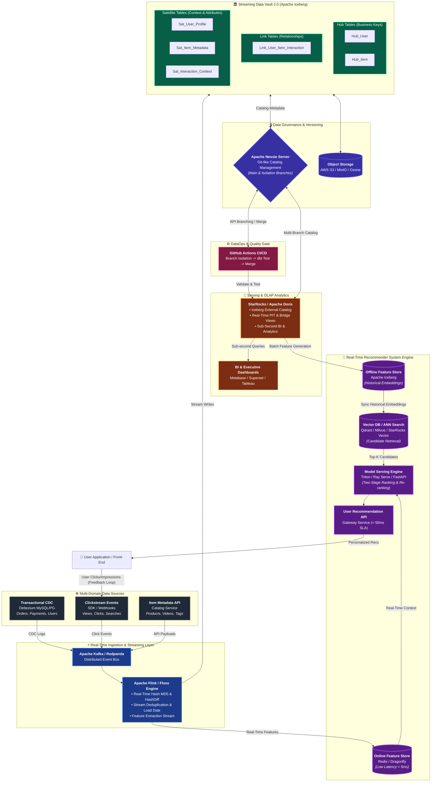
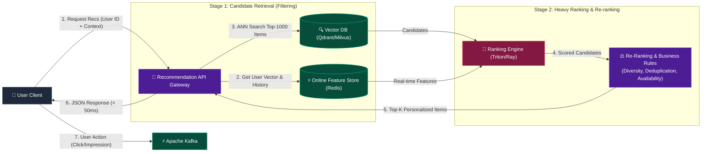
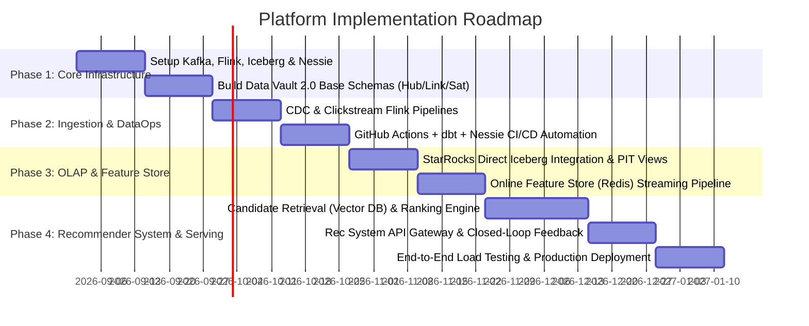

# 🚀 TECHNICAL PROPOSAL: REAL-TIME DATA MESH PLATFORM WITH STREAMING DATA VAULT 2.0, GIT-LIKE DATAOPS & END-TO-END RECOMMENDER SYSTEM

**Author:** ValoStream Engineering Team  
**Role:** Senior Data & AI Platform Architect  
**Status:** Proposal / Ready for Implementation  
**Target Architecture:** Enterprise Real-Time Data Lakehouse & AI/ML Recommendation Platform  

---

## 1. Context & Business Problem

As large-scale enterprise systems scale, traditional Data Platforms (built on Batch Processing + Star Schema) encounter 4 major bottlenecks:

1. **High Latency & Dirty Data on Production:** Batch ETL pipelines delay BI reports and AI models by hours or days. Simultaneously, the lack of an isolated staging/testing environment risks leaking "dirty data" into production when deploying new code or pipelines.
2. **Brittle Schema Evolution:** Source data schemas (E-commerce, Clickstream, CDC) evolve continuously. Traditional Dimensional Modeling (Kimball) requires altering Fact/Dimension tables, creating significant risks of pipeline downtime.
3. **Lack of Data Versioning:** No Git-like version control mechanism (Branch / Merge / Rollback) exists for data, making automated Data Quality Testing, A/B Testing, or instant disaster recovery during ingestion failures impossible.
4. **Gap Between Data Warehouse and Real-Time AI / Recommender Systems:** Data serving personalized user recommendations is fragmented. There is no unified Feature Store synchronizing real-time streaming features with historical batch Data Vault features, resulting in elevated latency for end-user serving (<50ms SLA).

---

## 2. Proposed Solution

Build a modern **Real-Time Data Mesh Platform** powered by **Streaming Data Vault 2.0** methodology, integrated with the next-generation Lakehouse ecosystem (**Apache Iceberg + Apache Nessie**), **DataOps (CI/CD for Data)** automation via GitHub Actions, and an **End-to-End Real-Time Recommender System** for personalized user serving.

### Key Architecture Stack:
* **Ingestion & Streaming:** Apache Kafka / Redpanda + Apache Flink / Fluss (Real-time Hash Key $MD5$, HashDiff & Data Vault Transformations).
* **Storage & Governance:** Apache Iceberg + Apache Nessie (Git-like Data Catalog, Zero-Copy Branching).
* **Serving & Query Acceleration:** StarRocks / Apache Doris (Sub-second vectorized OLAP on PIT/Bridge Views).
* **Feature Store & Real-Time ML:** Feast / Redis (Online Feature Store) + Iceberg (Offline Feature Store).
* **Recommender System Engine:** Vector DB (Qdrant/Milvus) + Two-Stage Ranking Engine (Triton / Ray Serve / FastAPI) + Closed-Loop Feedback Stream.
* **DataOps & Quality Gate:** GitHub Actions + dbt Core (Automated testing & merging on isolated Nessie branches).

---

## 3. High-Level Architecture

### 3.1 End-to-End Data & ML Flow Diagram



---

### 3.2 DataOps Branching & Integration Sequence

```mermaid
sequenceDiagram
    autonumber
    actor DE as Data Engineer
    participant GH as GitHub Actions
    participant NES as Apache Nessie Catalog
    participant FLK as Flink Engine
    participant STR as StarRocks / Doris
    participant DBT as dbt Testing Framework
    participant REC as Recommender API

    DE->>GH: 1. Push Code / Open PR (e.g. Add Sat_User_Behavior_v2)
    
    rect rgb(30, 41, 59)
        note over GH, NES: Phase 1: Zero-Copy Isolation Environment
        GH->>NES: 2. Create Branch `pr_feature_123` from `main`
        NES-->>GH: 3. Branch `pr_feature_123` Ready
    end

    rect rgb(15, 23, 42)
        note over GH, FLK: Phase 2: Stream Testing on Isolated Branch
        GH->>FLK: 4. Deploy Flink Test Job to Nessie Branch `pr_feature_123`
        FLK->>NES: 5. Write Data Vault HashKeys & Satellites into `pr_feature_123`
    end

    rect rgb(30, 41, 59)
        note over GH, DBT: Phase 3: Automated Data Quality Gate
        GH->>DBT: 6. Run dbt Data Quality Tests against StarRocks (Branch `pr_feature_123`)
        DBT->>STR: 7. Execute Validation Queries (Unique Keys, Foreign Keys, Non-Null)
        STR-->>DBT: 8. Return Test Results
    end

    alt ALL TESTS PASSED
        DBT-->>GH: 9. ✅ Tests Passed
        GH->>NES: 10. Merge `pr_feature_123` -> `main`
        NES-->>GH: 11. Merge Complete
        GH->>NES: 12. Delete Branch `pr_feature_123`
        GH->>REC: 13. Trigger Feature Store Schema Sync
        GH-->>DE: 14. Auto-Approve & Merge PR
    else TESTS FAILED
        DBT-->>GH: 9. ❌ Test Failure Detected
        GH->>NES: 10. Delete Branch `pr_feature_123` (Atomic Rollback)
        GH-->>DE: 11. Report Errors on PR & Block Merge
    end
```



---

## 4. Detailed Streaming Data Vault 2.0 Architecture

Data Vault 2.0 is selected as the core storage methodology due to its flexibility with **Schema Evolution**, allowing seamless data additions without breaking downstream consumers (Zero Downtime).

### 4.1 Data Vault Component Modeling

1. **Hub Tables (Core Business Entities):**
   * Contains strictly the **Business Key** (e.g., `user_id`, `item_id`), Hash Key ($MD5$), `load_date`, and `record_source`.
   * *Immutable: Never updated or modified.*

2. **Link Tables (Relationships Between Hubs):**
   * Represents interactions or transactions between business entities (e.g., User Click Item, User Order Product).
   * Contains the Link Hash Key (`Link_HashKey`), Hash Keys of participating Hubs, `load_date`, and `record_source`.

3. **Satellite Tables (Context & Temporal Attributes):**
   * Stores descriptive metadata and historical state changes of attributes.
   * Utilizes **HashDiff** ($MD5$ of all attribute columns) to detect state changes without expensive JOINs.
   * Enables seamless creation of `Sat_..._v2` when upstream sources add attributes, avoiding breaking existing pipelines.

4. **Point-In-Time (PIT) & Bridge Views:**
   * PIT Tables/Views unify Satellites at any given point in time without complex `LEFT JOIN` chains on historical records.
   * Accelerates queries for StarRocks/Doris and Feature Store extraction.

---

### 4.2 Concrete Data Vault Schema Definition (SQL Example)

```sql
-- 1. Hub_User Table (Apache Iceberg)
CREATE TABLE vault.hub_user (
    hk_user_id STRING NOT NULL,      -- MD5(user_id)
    user_id STRING NOT NULL,         -- Business Key
    load_date TIMESTAMP NOT NULL,    -- Timestamp Ingestion
    record_source STRING NOT NULL    -- E.g. 'cdc.mysql.users'
) USING iceberg
PARTITIONED BY (days(load_date));

-- 2. Hub_Item Table (Apache Iceberg)
CREATE TABLE vault.hub_item (
    hk_item_id STRING NOT NULL,      -- MD5(item_id)
    item_id STRING NOT NULL,         -- Business Key
    load_date TIMESTAMP NOT NULL,
    record_source STRING NOT NULL
) USING iceberg
PARTITIONED BY (days(load_date));

-- 3. Link_User_Item_Interaction Table
CREATE TABLE vault.link_user_item_interaction (
    hk_interaction_id STRING NOT NULL, -- MD5(user_id + item_id + event_time)
    hk_user_id STRING NOT NULL,
    hk_item_id STRING NOT NULL,
    load_date TIMESTAMP NOT NULL,
    record_source STRING NOT NULL
) USING iceberg
PARTITIONED BY (days(load_date));

-- 4. Sat_User_Profile Table (Attributes & History)
CREATE TABLE vault.sat_user_profile (
    hk_user_id STRING NOT NULL,
    load_date TIMESTAMP NOT NULL,
    hash_diff STRING NOT NULL,        -- MD5(age + gender + location + preference_category)
    age INT,
    gender STRING,
    location STRING,
    preference_category STRING,
    record_source STRING NOT NULL
) USING iceberg
PARTITIONED BY (days(load_date));

-- 5. Sat_Interaction_Context Table (Real-Time Clickstream Context)
CREATE TABLE vault.sat_interaction_context (
    hk_interaction_id STRING NOT NULL,
    load_date TIMESTAMP NOT NULL,
    hash_diff STRING NOT NULL,
    event_type STRING,                -- 'view', 'click', 'add_to_cart', 'purchase'
    device_type STRING,
    dwell_time_ms BIGINT,
    referrer_page STRING,
    record_source STRING NOT NULL
) USING iceberg
PARTITIONED BY (days(load_date));
```

---

## 5. Real-Time Ingestion & Streaming Processing (Flink / Fluss & Kafka)

### 5.1 Real-Time Streaming Pipeline
1. **CDC & Clickstream Ingestion:**
   * Debezium captures transactional changes from MySQL/PostgreSQL into Kafka topics (`cdc.users`, `cdc.products`).
   * Front-end SDKs stream Clickstream Events directly into Kafka topic (`events.clickstream`).

2. **Flink SQL Streaming Transformations:**
   * Calculates `MD5(Business_Key)` to derive `hk_user_id`, `hk_item_id`.
   * Calculates `MD5(concat_ws(';', attributes...))` to derive `hash_diff`.
   * Performs Stream Deduplication against state stateful operators.
   * Writes directly to Iceberg tables via Iceberg Flink Sink supporting **Exactly-Once Semantics**.

3. **Late Data & Dead Letter Queue (DLQ) Handling:**
   * Implements a **Watermark Strategy** allowing up to 15 seconds of late-arriving clickstream events.
   * Excessively late events (> Watermark) or schema validation failures are automatically routed to a **Kafka DLQ Topic** (`dlq.events.invalid`) for inspection & reprocessing.

---

## 6. DataOps & Git-like Governance (Apache Nessie + Iceberg + dbt + GitHub Actions)

### 6.1 Data Versioning Workflow
Apache Nessie functions as a "Git Catalog" for Apache Iceberg with the following core mechanics:
* **Zero-Copy Branching:** Spawns isolated data branches (`pr_feature_xyz`) without duplicating underlying Parquet files on S3.
* **Isolated Testing:** Flink / dbt write and test data exclusively on isolated branches. Production (`main`) remains completely untouched.
* **Atomic Merge & Instant Rollback:** Once Data Quality Tests pass 100%, perform an API Merge into `main`. If an anomaly occurs on Production, `Nessie Rollback` restores the catalog state to a previous commit in seconds.

### 6.2 Data Quality Gate (dbt Tests)
Automated testing scenarios executed via GitHub Actions prior to merging:
1. **Uniqueness:** Hash Keys in Hub Tables must be unique.
2. **Referential Integrity:** Hash Keys in Link Tables must exist in corresponding Hub Tables.
3. **Data Completeness:** Required fields (`load_date`, `record_source`, `hash_diff`) must not be NULL.
4. **Distribution Anomaly Check:** Verifies record counts against anomaly thresholds (>50% variation from historical ingestion runs).

---

## 7. OLAP Serving & Query Acceleration (StarRocks / Apache Doris)

### 7.1 Serving Layer Strategy
* **Direct Iceberg Integration:** StarRocks connects directly to Apache Nessie Catalog to query Iceberg Parquet files natively without separate ETL steps.
* **Real-Time Materialized Views:** Automatically flattens and aggregates data from Data Vault Satellites & Links into ready-to-use analytical views for BI Dashboards.
* **Vectorized Execution Engine:** Delivers sub-second query latency (<100ms) over billions of clickstream & transaction records.

---

## 8. End-to-End Real-Time Recommender System Architecture

The Recommender System is architected as a **Two-Stage Recommendation Pipeline** integrated with a **Real-Time Streaming Feature Store**, serving personalized recommendations to end-users at ultra-low latency.



---

### 8.1 Real-Time & Batch Feature Store Architecture

To balance long-term historical accuracy with real-time user intent:

1. **Online Feature Store (Redis / Dragonfly):**
   * **Real-Time Streaming Features:** Flink SQL continuously computes features from Kafka Clickstream and updates Redis within **< 100ms**:
     * `user:last_5_clicked_categories` (List of recently viewed categories).
     * `user:session_dwell_time_avg` (Average session dwell time).
     * `item:realtime_click_ctr_1h` (Item 1-hour click-through rate).
   * **Latency SLA:** Read performance < 5ms (p99).

2. **Offline Feature Store (Apache Iceberg via Data Vault):**
   * **Batch Historical Features:** Extracted from Data Vault PIT/Bridge Views via Flink/StarRocks on daily/hourly schedules:
     * `user:historical_category_affinity` (90-day preference affinity matrix).
     * `user:lifetime_value_score` (User LTV score).
     * `item:content_embedding_vector` (Item content embedding vector from AI models).
   * Synchronizes historical embeddings and batch features to the Online Store & Vector DB periodically.

---

### 8.2 Two-Stage Recommendation Engine Design

#### **Stage 1: Candidate Retrieval (Candidate Matching - Top 1000)**
* **Objective:** Reduce search space from millions of items to 1,000 candidate items in < 15ms.
* **Techniques:**
  1. **Vector / Embedding Search:** Two-Tower Neural Network (User Tower & Item Tower). User Vector (retrieved from Online Feature Store) executes ANN Search (Approximate Nearest Neighbor) against Vector DB (Qdrant / Milvus / StarRocks Vector) to fetch 500 top similar items.
  2. **Real-time Collaborative Filtering:** Retrieves items similar to the last 5 items interacted with by the user.
  3. **Trending & Popularity Fallback:** Fetches top 100 trending items over the past hour (for Cold-start Users).

#### **Stage 2: Heavy Ranking & Scoring (Top 50)**
* **Objective:** Accurately estimate probability $P(\text{Click})$ or $P(\text{Conversion})$ for each of the 1,000 candidates.
* **Model Architecture:** Deep Learning (Deep & Cross Network - DCNv2 / DIN) or LightGBM/XGBoost deployed on **Triton Inference Server** or **Ray Serve**.
* **Input Feature Vector:**
  $$\text{Feature Vector} = [\text{User Realtime Features} \oplus \text{User Historical Features} \oplus \text{Item Realtime Features} \oplus \text{Cross Features}]$$

#### **Stage 3: Re-Ranking & Business Rules (Top 10-20 Final Response)**
* **Diversity Control:** Ensures no more than 3 items from the same category appear consecutively (Maximal Marginal Relevance - MMR).
* **De-duplication & Suppression:** Filters out items viewed or purchased by the user within the last 24 hours.
* **Inventory & Freshness Filter:** Checks real-time stock availability and boosts newly created items (Cold-start Item Boosting).

---

### 8.3 Low-Latency Serving API Infrastructure

* **API Gateway & Service:** Built with Go / Rust or Async Python (FastAPI + uvloop) enforcing strict SLAs:
  * **p95 Latency:** $< 35\text{ ms}$
  * **p99 Latency:** $< 50\text{ ms}$
* **Circuit Breaker & Fallback:** If Vector DB or Inference Server times out (>30ms), the API automatically falls back to Top Trending Items cached in memory (Guava / Redis Local Cache), maintaining 99.99% availability.

---

### 8.4 Closed-Loop Feedback & Continuous Model Learning

```text
[ User Interaction ] ──► [ Kafka Clickstream ] ──► [ Flink Streaming ]
                                                          │
                    ┌─────────────────────────────────────┴─────────────────────────────────────┐
                    ▼                                                                           ▼
[ Online Feature Store Update (Redis) ]                                    [ Iceberg Data Vault Log ]
      (Instant Update < 100ms)                                               (Historical Training Log)
                                                                                                │
                                                                                                ▼
[ Continuous Retraining (Airflow/Kubeflow) ] ◄─── [ Data Quality & Drift Check ] ◄──────────────┘
                    │
                    ▼
[ Model Registry & Shadow Deployment ] ──► [ A/B Test Serving ]
```

1. **Real-Time Attribution & Impression Logging:**
   * When Rec API responds, an `Impression Event` containing `recommendation_id` is emitted to Kafka.
   * When a user clicks, a `Click Event` carrying the same `recommendation_id` is joined real-time in Flink to produce **Online Labelled Training Data**.
2. **Model Monitoring & Drift Detection:**
   * Evaluates metrics using **Evidently AI / Great Expectations** on Flink streams to detect Data Drift (feature distribution changes) or Concept Drift (CTR decay).
3. **Continuous Retraining Pipeline:**
   * Airflow / Kubeflow schedules daily/weekly model retraining jobs on updated Data Vault tables in Iceberg.
   * Newly trained models are published to MLflow Model Registry and deployed via **Shadow Deployment** or **A/B Testing** (10% traffic) prior to full rollout.

---

## 9. Security, Governance & Data Mesh Compliance

1. **Domain Ownership & Data Contracts:**
   * Each domain (E-Commerce, Clickstream, Supply Chain) retains full ownership over its schemas and data quality.
   * Enforces **Protobuf / JSON Schema Registries** at the Kafka Ingestion layer to block malformed payloads before entering the Lakehouse.
2. **PII Data Security & Masking:**
   * Personally Identifiable Information (Email, Phone, SSN) within Satellites must be Salted-Hashed ($SHA256$) or encrypted before writing to Iceberg.
3. **Fine-Grained Access Control (RBAC / ABAC):**
   * Role-based access control across Nessie Catalog and StarRocks:
     * Data Analyst: Access to PII-masked PIT Views.
     * ML Engineer: Access to Feature Store & Vector DB.
     * Admin: Full pipeline management.

---

## 10. Reliability, Scalability & Disaster Recovery

1. **Backpressure & Flow Control:**
   * Kafka & Flink leverage Reactive Streams Backpressure to automatically throttle ingestion when downstream writes (Iceberg/Redis) experience congestion.
2. **Idempotent Writes & Exactly-Once:**
   * Iceberg Flink Committers use **Two-Phase Commit Protocol** to guarantee zero duplicated writes into Data Vault even upon Flink Job restarts.
3. **Disaster Recovery & Time-Travel Capability:**
   * Leverages **Time-Travel** in Apache Iceberg and **Commit History** in Apache Nessie:
     * If a Flink job writes corrupt data to Iceberg on `main`, DataOps can rollback `main` to a previous commit hash in seconds (`nessie branch assign main --ref <valid_commit_hash>`).

---

## 11. Technology Stack Summary & Implementation Matrix

| Architecture Layer | Technology Stack | Core Role & Responsibilities |
| :--- | :--- | :--- |
| **Ingestion Bus** | Apache Kafka / Redpanda | Real-time Event Streaming & CDC transport bus |
| **Streaming Computation** | Apache Flink / Fluss SQL | Computes HashKeys, HashDiff, Windowing, Real-time Feature extraction |
| **Storage Standard** | Apache Iceberg | Open Data Lakehouse format supporting ACID & Schema Evolution |
| **Catalog & Governance** | Apache Nessie | Git-like catalog version control (Branch, Merge, Rollback) |
| **Object Storage** | MinIO / AWS S3 / Apache Ozone | Scalable object storage for underlying Parquet files |
| **OLAP Engine** | StarRocks / Apache Doris | Sub-second vectorized queries for BI & Aggregated Views |
| **Online Feature Store** | Redis / Dragonfly | Low-latency real-time feature storage for RecSys (<5ms SLA) |
| **Vector Database** | Qdrant / Milvus / StarRocks Vector | Vector embeddings storage & ANN search for candidate retrieval |
| **Model Inference** | Triton Inference Server / Ray Serve | High-throughput serving for two-stage AI ranking models |
| **Serving API Gateway** | FastAPI / Go Service | REST/gRPC API serving personalized recommendations (<50ms SLA) |
| **DataOps CI/CD** | GitHub Actions + dbt Core | Automated Data Quality Testing on isolated Nessie branches |
| **Orchestration & ML** | Apache Airflow / MLflow | Workflow scheduling, model retraining, and ML Model Registry |

---

## 12. Implementation Roadmap



---

> [!IMPORTANT]
> **Conclusion & Value Proposition:**  
> This architecture proposal addresses all 4 key data platform challenges:
> 1. **Zero-Downtime Schema Evolution** via Streaming Data Vault 2.0.
> 2. **Guaranteed Data Quality & Production Safety** via Git-like DataOps (Nessie + Iceberg + GitHub Actions).
> 3. **Sub-second Analytical BI Performance** powered by StarRocks OLAP Engine.
> 4. **Ultra-Low Latency Real-Time Personalized Recommender System** (<50ms SLA) fed directly from normalized Lakehouse streaming pipelines.