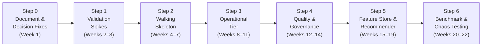
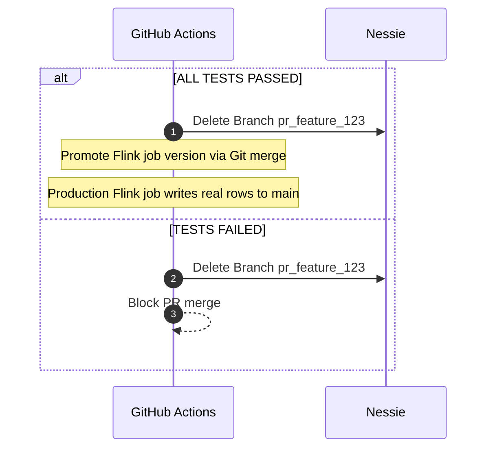
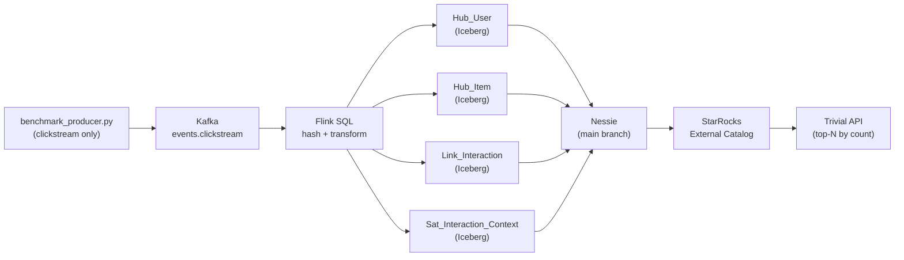
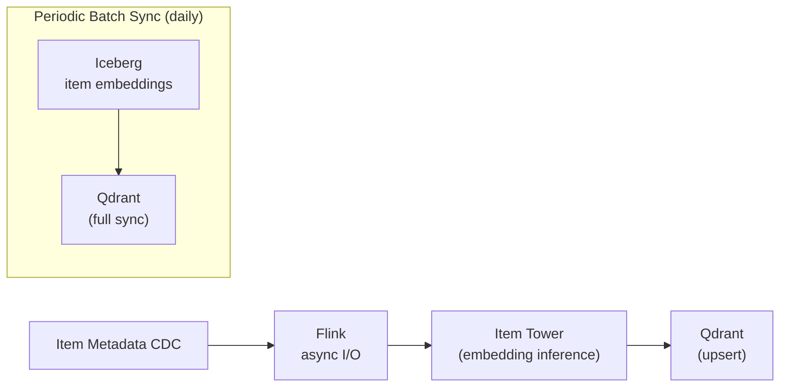

# ValoStream Project Steps — Post Architecture Review

**Author:** ValoStream Engineering Team
**Date:** 2026-09-15
**Source:** Architecture Review (31 findings against `archi.md` at commit `eb4c50e`)
**Status:** Execution Plan — Pending Implementation

---

## Executive Summary

The architecture review surfaced **31 findings** (5 blocker, 17 major, 9 minor) against
the ValoStream technical proposal. The core technology selections — Data Vault 2.0,
Iceberg + Nessie, branch-per-PR DataOps — are sound. What is missing is:

1. **An operational tier** — no table maintenance, no concurrent-writer strategy, no
   observability beyond model drift.
2. **A latency budget that closes** — the 50 ms p99 claim cannot be met with the
   documented hop sequence.
3. **Decided technology choices** — 12 of 12 stack rows still list alternatives.
4. **A walking-skeleton roadmap** — the current plan builds bottom-up and delays
   end-to-end validation until month 4.

This document replaces the §12 roadmap with a **6-step phased plan** that resolves every
finding, front-loads risk, and delivers an end-to-end skeleton within the first 7 weeks.

### Findings by Severity

| Severity | Count | Resolution Target |
|:---------|:-----:|:------------------|
| Blocker  |   5   | Steps 0–1 (weeks 1–3) |
| Major    |  17   | Steps 0–5 (weeks 1–19) |
| Minor    |   9   | Steps 0–6 (weeks 1–22) |

### Phase Overview



---

## Step 0: Document & Decision Fixes

**Timeline:** Week 1 (5 person-days)
**Goal:** Transform `archi.md` from a technology survey into an implementable specification.
No infrastructure changes — only document edits, decisions, and ADRs.

---

### 0.1 Fix CI Merge Semantics

| Field | Value |
|:------|:------|
| **Finding** | CI-1 (Blocker) |
| **Problem** | §3.2 step 10 merges the PR branch into `main` on success, promoting test data into production. The Nessie merge carries data commits, not just schema definitions — every row the test Flink job wrote lands in the production catalog. |
| **Root Cause** | The sequence diagram treats the Nessie branch as a delivery mechanism instead of a disposable test bed. |

**Fix:**

Modify the §3.2 sequence diagram so the **success path deletes the branch** — identical
to the failure path. The artifact promoted to production is the Flink job version and the
dbt model version (promoted via the normal Git merge), not the Nessie data.



If data promotion for backfills is needed, document it as a separate, explicitly-scoped
workflow in its own subsection.

**Deliverables:**
- [ ] Updated §3.2 sequence diagram in `archi.md`
- [ ] New subsection: "Data Backfill Promotion Workflow" (if applicable)

**Acceptance criteria:**
- Success path and failure path both delete the Nessie branch
- No merge of data commits into `main` in the standard CI flow

---

### 0.2 Decide All 12 Stack Rows & Write ADRs

| Field | Value |
|:------|:------|
| **Finding** | DOC-1 (Major) |
| **Problem** | Every layer in §11 offers alternatives (Kafka/Redpanda, Flink/Fluss, StarRocks/Doris, etc.). Twelve rows, most undecided. Nobody can start Phase 1 because the first task — "Setup Kafka, Flink, Iceberg & Nessie" — contains an unresolved choice. |
| **Root Cause** | The document is a technology survey, not an architecture decision. |

**Fix:**

Pick one technology per row. Move alternatives into a short ADR appendix per decision.

**ADR format** (per decision):

```markdown
## ADR-NNN: [Component] Selection

**Status:** Accepted
**Context:** [Why this decision matters]
**Decision:** [Chosen technology]
**Alternatives considered:** [List with 1-line rationale for rejection]
**Consequences:** [Trade-offs accepted]
```

**Decisions required (12 rows):**

| # | Layer | Candidates | Recommended | Rationale |
|:-:|:------|:-----------|:------------|:----------|
| 1 | Ingestion Bus | Kafka / Redpanda | Apache Kafka | Larger ecosystem, Flink connector maturity, Debezium native support |
| 2 | Streaming Computation | Flink / Fluss | Apache Flink | Fluss is streaming storage, not compute — see 0.4 |
| 3 | Storage Standard | Iceberg | Apache Iceberg | No alternative listed — confirmed |
| 4 | Catalog & Governance | Nessie | Apache Nessie | No alternative listed — confirmed |
| 5 | Object Storage | S3 / MinIO / Ozone | MinIO (dev) / S3 (prod) | MinIO for local dev parity, S3 for production |
| 6 | OLAP Engine | StarRocks / Doris | StarRocks | Iceberg external catalog support, vectorized engine maturity |
| 7 | Online Feature Store | Redis / Dragonfly | Redis | Ecosystem maturity, Flink connector availability |
| 8 | Vector Database | Qdrant / Milvus / StarRocks Vector | Qdrant | Purpose-built ANN, gRPC API, simpler ops than Milvus |
| 9 | Model Inference | Triton / Ray Serve / FastAPI | Triton Inference Server | GPU batching, multi-framework, production-grade |
| 10 | Serving API Gateway | FastAPI / Go Service | Go (net/http) | Latency budget demands low-overhead runtime |
| 11 | DataOps CI/CD | GitHub Actions + dbt | GitHub Actions + dbt Core | No alternative listed — confirmed |
| 12 | Orchestration & ML | Airflow / MLflow | Airflow + MLflow | Complementary — Airflow for DAGs, MLflow for registry |

> [!NOTE]
> The recommendations above are starting positions. Each should be validated or
> overridden during the ADR writing process based on team expertise and licensing.

**Deliverables:**
- [ ] 12 ADR documents in `docs/adr/` directory
- [ ] Updated §11 table with single choices and ADR references
- [ ] Remove all "/" alternatives from §2 and body text

**Acceptance criteria:**
- Every row in §11 names exactly one technology
- Each choice has a written ADR with alternatives and rationale

---

### 0.3 Retitle Away from Data Mesh (or Add Mechanics)

| Field | Value |
|:------|:------|
| **Finding** | GOV-1 (Major) |
| **Problem** | Title says "Data Mesh" but architecture is centralized: one Nessie catalog, one Iceberg warehouse, one Flink cluster, one vault.* namespace. No per-domain namespaces, no data product interfaces, no federated governance, no self-serve path. |
| **Root Cause** | Positioning mismatch — the engineering is centralized lakehouse, not mesh. |

**Fix (choose one):**

**Option A — Retitle (recommended, zero cost):**
```diff
- # TECHNICAL PROPOSAL: REAL-TIME DATA MESH PLATFORM WITH STREAMING DATA VAULT 2.0...
+ # TECHNICAL PROPOSAL: REAL-TIME STREAMING LAKEHOUSE WITH DATA VAULT 2.0...
```
Remove "Data Mesh" from §1, §2, §9 headers. Keep all engineering unchanged.

**Option B — Add mesh mechanics (significant effort):**
- Catalog namespace per domain (`vault_ecommerce.*`, `vault_clickstream.*`)
- Data product contract template with freshness and quality SLOs
- Self-serve onboarding path for domain teams
- Federated governance model

**Deliverables:**
- [ ] Updated title and section headers in `archi.md`
- [ ] If Option B: new §9.4 "Data Mesh Mechanics" subsection

**Acceptance criteria:**
- Title accurately describes the architecture's governance model
- No claim of domain ownership without enabling mechanism

---

### 0.4 Correct Flink/Fluss Terminology & Define Fluss's Storage Role

| Field | Value |
|:------|:------|
| **Finding** | DOC-4 (Minor) |
| **Problem** | "Apache Flink / Fluss Engine" appeared throughout as though they were competing compute engines. Fluss is actually a **streaming storage** layer (columnar, updatable stream store with primary key changelog support) designed specifically to work *with* Flink, rather than replace it. |

**Fix:**

1. Compute slot: Establish **Apache Flink** cleanly as the stream compute engine (ADR-002).
2. Streaming Storage slot: Document **Apache Fluss** as a complementary streaming storage tier (ADR-013) that helps Flink by buffering sub-second updates and tiering them into Iceberg in clean batches, resolving the small-file problem (OPS-1) if direct 30-60s Iceberg commits prove insufficient during Spike 1.2.

**Deliverables:**
- [x] Corrected all "Flink / Fluss" references in `archi.md` compute slots
- [x] Published [ADR-002](docs/adr/ADR-002-streaming-engine.md) defining Flink as the compute engine
- [x] Published [ADR-013](docs/adr/ADR-013-streaming-storage-tier.md) evaluating Fluss as the complementary streaming storage tier in front of Iceberg
- [x] Updated §11 table in `archi.md` with Fluss evaluated as streaming storage

**Acceptance criteria:**
- No instance of Fluss in the compute engine slot
- Fluss is accurately positioned as an evaluated streaming storage companion to Flink and Iceberg

---

### 0.5 Reconcile Diagrams Against Stack Table

| Field | Value |
|:------|:------|
| **Finding** | DOC-5 (Minor) |
| **Problem** | Four inconsistencies: (1) Impression-logging path exists in §8 diagram but absent from §3.1; (2) dbt central to §6 but in no diagram; (3) Feast in §2/§11 but in no diagram; (4) StarRocks → Batch Feature Generation → FEAT_OFFLINE implies StarRocks writing to Iceberg (limited external catalog write support). |

**Fix:**
- Add impression-logging feedback arrow to §3.1 master diagram
- Add dbt node to §3.1 within the DataOps subgraph
- Either add Feast to the feature store subgraph or remove from §2/§11 (depends on REC-1 decision in Step 5)
- Redirect offline feature write from StarRocks to Flink/Spark (the engine that can perform bulk Iceberg writes)

**Deliverables:**
- [ ] Updated §3.1 mermaid diagram
- [ ] Updated §8 mermaid diagram
- [ ] Consistency audit checklist (every §11 row appears in exactly one diagram)

**Acceptance criteria:**
- Every component in §11 appears in at least one architecture diagram
- No diagram shows a data flow that the chosen technology cannot perform

---

### 0.6 Publish Hashing Standard

| Field | Value |
|:------|:------|
| **Finding** | DV-1 (Major) |
| **Problem** | Hash key uses plain concatenation (`MD5(user_id + item_id + event_time)`) which collides — `user_id="ab"` + `item_id="c"` hashes identically to `user_id="a"` + `item_id="bc"`. Hash diff uses `;` separator which can appear in free-text columns. No rules for column order, null handling, trimming, case, or encoding. |

**Fix:**

Add a new numbered subsection "§4.3 Hashing Standard" with these rules:

```
Hashing Standard — ValoStream DV2.0
─────────────────────────────────────
Algorithm:       MD5 (128-bit, hex-encoded lowercase)
Delimiter:       U+001F (Unit Separator) — cannot appear in business data
Null handling:   Replace NULL with literal string "^^NULL^^"
Trimming:        TRIM(value) before hashing
Case:            UPPER(value) for all string fields
Column order:    Alphabetical by column name within each hash scope
Encoding:        UTF-8 bytes
Implementation:  Single shared UDF, called by Flink, dbt, and Spark
```

```sql
-- Example: Hash Key
hk_interaction_id = MD5(
  UPPER(TRIM(COALESCE(event_time, '^^NULL^^')))
  || U+001F
  || UPPER(TRIM(COALESCE(item_id, '^^NULL^^')))
  || U+001F
  || UPPER(TRIM(COALESCE(user_id, '^^NULL^^')))
)
-- Fields in alphabetical order: event_time, item_id, user_id
```

**Deliverables:**
- [ ] New §4.3 in `archi.md`
- [ ] Hashing UDF specification (Java for Flink, SQL macro for dbt)
- [ ] Updated §4.2 SQL examples with correct delimiter and null handling

**Acceptance criteria:**
- Hash computation is deterministic and reproducible across Flink, dbt, and Spark
- No plain concatenation without delimiter in any hash formula
- Null handling is explicit

---

## Step 1: Validation Spikes

**Timeline:** Weeks 2–3 (10 person-days)
**Goal:** Prove or disprove the three load-bearing assumptions before committing to
infrastructure build-out. Any spike failure changes the architecture.

---

### 1.1 Spike: Branch-Scoped StarRocks Against Nessie

| Field | Value |
|:------|:------|
| **Finding** | CI-2 (Major) |
| **Problem** | §3.2 step 7 runs dbt tests against StarRocks pointed at branch `pr_feature_123`. StarRocks' Iceberg external catalog binds to a Nessie reference at catalog-creation time — every PR needs a freshly created external catalog, which must be torn down afterward. At real PR cadence, this is catalog churn on a production OLAP cluster. |
| **Risk** | If per-PR catalogs prove unworkable, the entire DataOps concept changes shape. |

**Spike protocol:**

```
1. Deploy: Nessie + Iceberg + StarRocks (minimal, single-node)
2. Create 10 Nessie branches, each with a small Iceberg table
3. For each branch:
   a. CREATE EXTERNAL CATALOG pointing to that branch reference
   b. Run 5 analytical queries
   c. DROP CATALOG
4. Measure: catalog creation time, query latency, catalog teardown time
5. Repeat at PR cadence: 1 branch/min for 30 minutes
6. Record: StarRocks FE heap usage, Nessie API latency under load
```

**Fallback if spike fails:**
Run the quality gate through Flink SQL or Spark SQL against Nessie directly (both accept
a branch reference per session). Use StarRocks only for production serving on `main`.

**Deliverables:**
- [ ] Spike report with measured latencies and resource usage
- [ ] Go/no-go decision on branch-scoped StarRocks
- [ ] If no-go: updated §3.2 with fallback query engine

**Acceptance criteria:**
- Catalog create + query + teardown completes in < 30 seconds
- No FE instability after 30 branch cycles
- Decision documented as ADR

---

### 1.2 Spike: Nessie Commit Ceiling & Table Maintenance

| Field | Value |
|:------|:------|
| **Findings** | OPS-1 (Blocker), OPS-2 (Blocker) |
| **Problem (OPS-1)** | 2-second Flink checkpoints × partitioned Iceberg writes = ~43,000 commits/day, ~700,000 files/table/day at parallelism 16. No compaction design exists. |
| **Problem (OPS-2)** | Three writers race for one Nessie branch head: streaming Flink commits, CI merges, and compaction jobs. No conflict strategy. |

**Spike protocol:**

```
1. Deploy: Nessie (JDBC backend, PostgreSQL) + Iceberg + Flink (parallelism 4)
2. Run a synthetic Flink job writing to a partitioned Iceberg table:
   a. Checkpoint interval: 2s → measure commits/min and file count growth
   b. Checkpoint interval: 30s → same measurements
   c. Checkpoint interval: 60s → same measurements
3. After 1 hour at each interval, run:
   a. rewrite_data_files (bin-pack, sort on hash key)
   b. rewrite_manifests
   c. expire_snapshots
4. During compaction, keep the streaming job running — observe conflicts
5. Measure: Nessie commits/sec ceiling, conflict rate, retry count
6. Test concurrent CI merge during active streaming + compaction
```

**Key numbers to extract:**

| Metric | Target |
|:-------|:-------|
| Nessie sustained commits/sec | Document actual ceiling |
| File count after 1 hour (2s checkpoint) | Expect ~30,000+ |
| File count after compaction | < 500 |
| Compaction conflict rate during streaming | Must be < 5% |
| Query planning time before/after compaction | Expect 10x+ improvement after |

**Design decisions dependent on results:**

| If... | Then... |
|:------|:--------|
| 2s checkpoint produces unsustainable file churn | Relax to 30–60s, accept freshness cost |
| Compaction conflicts are high | Dedicate namespace per writer, or compaction on side branch |
| Nessie commit ceiling is low | Size commit rate to ceiling, adjust parallelism |
| All of the above are problematic | Evaluate Fluss/Paimon as mutable streaming tier in front of Iceberg |

**Deliverables:**
- [ ] Spike report with all metrics above
- [ ] Chosen checkpoint interval with freshness SLA trade-off documented
- [ ] Concurrency model decision (ADR)
- [ ] Table maintenance schedule design:
  - `rewrite_data_files` frequency and sort keys
  - `rewrite_manifests` frequency
  - `expire_snapshots` retention window
  - Nessie GC tool schedule (not Iceberg's orphan-file cleanup)

**Acceptance criteria:**
- Measured Nessie commit ceiling documented
- Chosen checkpoint interval keeps file count manageable (< 10,000/table/day)
- Compaction runs without blocking or conflicting with streaming writes
- Maintenance jobs are scheduled, not aspirational

---

### 1.3 Spike: Recommender Latency Budget

| Field | Value |
|:------|:------|
| **Finding** | REC-2 (Blocker) |
| **Problem** | The 50 ms p99 budget does not close. Sequential hops (Redis → Qdrant → DCNv2 → re-rank) sum to 46–75 ms with zero slack. Stage 2 (ranking 1,000 candidates via DCNv2) is unbudgeted. |

**Latency budget to validate:**

| Hop | Claimed | To Measure |
|:----|:--------|:-----------|
| Gateway ingress + auth + parse | Not stated | Actual p99 |
| Online Feature Store read (Redis) | < 5 ms p99 | Actual p99 |
| ANN search, top-K (Qdrant) | < 15 ms | Actual p99 at K=200, 500, 1000 |
| Ranking DCNv2 forward pass | Not stated | Actual p99 at N=200, 500, 1000 candidates |
| Re-rank (MMR + suppression) | Not stated | Actual p99 |
| Serialization + egress | Not stated | Actual p99 |
| **End-to-end** | **< 50 ms** | **Actual p99** |

**Spike protocol:**

```
1. Deploy: Redis (single node) + Qdrant (single node) + Triton (GPU, single model)
2. Load: 100k item vectors into Qdrant, 10k user features into Redis
3. Build a minimal Go gateway that chains the hops sequentially
4. Benchmark with wrk2 at 100 RPS for 5 minutes, record full latency histogram
5. Vary candidate count: 200, 500, 1000
6. Identify the dominant hop
```

**Decision matrix:**

| If p99 end-to-end... | Then... |
|:----------------------|:--------|
| < 50 ms at K=1000 | Keep current design |
| < 50 ms only at K ≤ 300 | Cut Stage 2 input to 200–300 candidates |
| < 100 ms at K=1000 | Restate SLA as p99 < 100 ms, p50 < 30 ms |
| > 100 ms at K=1000 | Lighter ranker (LightGBM) with deep model on top slice only |

**Deliverables:**
- [ ] Measured latency per hop at each candidate count
- [ ] Revised SLA with budgeted per-hop breakdown
- [ ] Updated §8.2 and §8.3 in `archi.md`

**Acceptance criteria:**
- Every hop in the request path has a measured p99
- Sum of per-hop p99 values ≤ stated end-to-end SLA
- The single most expensive hop (ranking) has a concrete budget

---

### 1.4 Verify Dataset Access & Licensing

| Field | Value |
|:------|:------|
| **Finding** | BM-4 (Minor) |
| **Problem** | Taobao UserBehavior direct URL may require Tianchi registration. H&M dataset is Kaggle competition data with usage restrictions. Stated file sizes need verification. |

**Checklist:**

- [ ] Verify Taobao UserBehavior URL is publicly accessible without Tianchi login
- [ ] Confirm file size (~3.5 GB compressed, 10 GB raw)
- [ ] Review H&M Kaggle competition rules for non-competition usage rights
- [ ] If H&M is restricted: substitute RetailRocket or Amazon Reviews 2023
- [ ] Add one-line license note per dataset in §13.1

**Deliverables:**
- [ ] Verified download instructions per dataset
- [ ] License compliance notes in `archi.md`
- [ ] If any dataset is inaccessible: replacement dataset mapped to schema

**Acceptance criteria:**
- Every download command in §13.1 works without manual registration steps
- No license violation in benchmark usage

---

## Step 2: Walking Skeleton

**Timeline:** Weeks 4–7 (20 person-days)
**Goal:** Push one event type from Kafka through Flink into one Hub, one Link, one
Satellite in Iceberg, query through StarRocks, and serve through a trivial recommender.
It will be minimal — and it will surface integration issues while there is time to change
course.

**Dependencies:** Step 0 (all decisions made), Step 1 (spike results inform design)

---

### 2.1 Infrastructure Bootstrap (Phase 0 — Missing from Original Roadmap)

| Field | Value |
|:------|:------|
| **Finding** | DOC-3 (Minor) — "no Phase 0 for networking, IAM, Kubernetes, and secrets" |

**Deliverables:**
- [ ] Docker Compose or Kubernetes manifests for:
  - Kafka (3 brokers, decided in 0.2)
  - Flink (JobManager + 2 TaskManagers)
  - Nessie Server (JDBC backend)
  - PostgreSQL (Nessie metadata)
  - MinIO (object storage)
  - StarRocks (1 FE + 1 BE)
  - Redis (single node)
- [ ] Networking configuration (service discovery, ports)
- [ ] Secrets management (at minimum: environment variables, later KMS)
- [ ] `Makefile` or `justfile` for common operations

**Acceptance criteria:**
- `make up` starts all services
- `make down` tears down cleanly
- All services healthy and connectable

---

### 2.2 Single Event Type End-to-End

**Data flow for the skeleton:**



**Findings addressed in this step:**

| Finding | How |
|:--------|:----|
| OPS-3 (Major) — Unbounded dedup state | Implement bounded state TTL with documented trade-off. Specify RocksDB state backend sizing and checkpoint storage location. |
| OPS-4 (Major) — 15s watermark DLQs mobile traffic | Split into two paths: raw vault writes accept all events (no watermark), windowed feature computation keeps watermark with side output for stragglers. DLQ reserved for schema/validation failures only. |
| DV-2 (Major) — Sat_Interaction_Context has change-tracking for immutable events | Model as non-historized (transactional) satellite: drop `hash_diff`, drop `load_date` from primary key. Keep historized pattern only for `Sat_User_Profile` and `Sat_Item_Metadata`. |
| BM-1 (Major) — Benchmark dataset can't populate modeled schema | Synthesize missing attributes (`device_type`, `dwell_time_ms`, `referrer_page`) in the producer with realistic distributions. Document divergence from production schema. |
| BM-3 (Minor) — Mixed timestamp units | Normalize to epoch milliseconds. Rename fields to `event_ts_ms` / `ingest_ts_ms`. |

**Flink SQL skeleton (illustrative):**

```sql
-- Raw vault write: NO watermark, accept all events
INSERT INTO vault.hub_user
SELECT
    MD5(UPPER(TRIM(COALESCE(user_id, '^^NULL^^')))) AS hk_user_id,
    user_id,
    CURRENT_TIMESTAMP AS load_date,
    'kafka.events.clickstream' AS record_source
FROM clickstream_source
WHERE user_id IS NOT NULL;

-- Sat_Interaction_Context: transactional (non-historized)
-- No hash_diff, no load_date in PK (DV-2)
-- Includes Geospatial & H3 Hierarchical Indexing (ADR-014)
INSERT INTO vault.sat_interaction_context
SELECT
    MD5(
        UPPER(TRIM(COALESCE(CAST(event_ts_ms AS STRING), '^^NULL^^')))
        || CHR(31)
        || UPPER(TRIM(COALESCE(item_id, '^^NULL^^')))
        || CHR(31)
        || UPPER(TRIM(COALESCE(user_id, '^^NULL^^')))
    ) AS hk_interaction_id,
    event_type,
    device_type,
    dwell_time_ms,
    referrer_page,
    latitude,
    longitude,
    h3_geo_to_hindex(latitude, longitude, 7) AS h3_res7,   -- Macro spatial cell
    h3_geo_to_hindex(latitude, longitude, 9) AS h3_res9,   -- Micro spatial cell (sort key)
    ST_AsBinary(ST_Point(longitude, latitude)) AS geom_wkb, -- GeoParquet representation
    CURRENT_TIMESTAMP AS load_date,
    'kafka.events.clickstream' AS record_source
FROM clickstream_source;
```

**Deduplication strategy (OPS-3 fix):**

```
Option chosen: Bounded state TTL
─────────────────────────────────
- State TTL: 24 hours (configurable)
- Trade-off: Duplicate satellite rows possible after TTL eviction or job restart
- Mitigation: Periodic dedup compaction pass (daily) on Iceberg tables
- State backend: RocksDB
- State backend sizing: 50 GB per TaskManager (based on 1.3M users × ~200 bytes state)
- Checkpoint storage: s3://valostream-checkpoints/
```

**Late data strategy (OPS-4 fix):**

```
Path 1 — Raw Vault writes:
  • No watermark, no lateness bound
  • Accept all events regardless of arrival time
  • Late events land with their true event_time and actual load_date
  • DLQ only for schema validation failures

Path 2 — Windowed Feature Computation:
  • Watermark: 15 seconds
  • allowedLateness: 5 minutes
  • Side output for stragglers → updates feature, does not discard
  • Beyond allowedLateness: logged as metric, not DLQ'd
```

**Deliverables:**
- [ ] Flink SQL job: clickstream → Hub + Link + Sat (transactional)
- [ ] Apache Sedona & H3 integration in Flink (`sedona-flink`, `com.uber:h3`)
- [ ] Updated `Sat_Interaction_Context` schema (no `hash_diff`, no `load_date` in PK, plus H3 & GeoParquet fields)
- [ ] Kafka topic configuration: `events.clickstream`, `dlq.schema.invalid`
- [ ] StarRocks external catalog on Nessie `main`
- [ ] Trivial recommendation API: "top-10 items by interaction count this hour"
- [ ] Updated `benchmark_producer.py` with synthesized attributes (including GPS lat/lon) and ms timestamps

**Acceptance criteria:**
- One event flows from producer → Kafka → Flink → Iceberg → StarRocks → API response
- H3 spatial indexes (`h3_res7`, `h3_res9`) and `geom_wkb` are computed accurately during stream ingestion
- Hub key uniqueness holds after 100k events
- Link referential integrity: every link hash key has corresponding hub entries
- No legitimate events routed to DLQ (only synthetic schema violations)
- Timestamps in Iceberg are consistently epoch milliseconds

---

## Step 3: Operational Tier

**Timeline:** Weeks 8–11 (20 person-days)
**Goal:** Add the operational layer that keeps components alive under continuous streaming
load — the central gap identified by the review.

**Dependencies:** Step 1 spike results (checkpoint interval, commit ceiling), Step 2
walking skeleton running

---

### 3.1 Table Maintenance Design

| Field | Value |
|:------|:------|
| **Finding** | OPS-1 (Blocker) — resolved by spike in 1.2, implemented here |

**Maintenance schedule (template — intervals from spike results):**

| Operation | Frequency | Scope | Config |
|:----------|:----------|:------|:-------|
| `rewrite_data_files` | Every 4 hours | Per table | Bin-pack, sort on hash key, target file size 256 MB |
| `rewrite_manifests` | Daily | Per table | — |
| `expire_snapshots` | Daily | Per table | Retain last 7 days |
| Nessie GC | Weekly | Global | Use Nessie GC tool, not Iceberg orphan-file cleanup |

**Implementation:**
- Airflow DAG: `dag_iceberg_maintenance.py`
- Runs compaction on a **side branch** to avoid conflicts with streaming writer
- Merges compacted state during a brief quiescence window (or accepts per-table serialization)

**Deliverables:**
- [ ] `dag_iceberg_maintenance.py` — Airflow DAG for all maintenance operations
- [ ] Nessie GC configuration and schedule
- [ ] Monitoring dashboard: file count per table, manifest count, snapshot count
- [ ] Documented freshness SLA trade-off (checkpoint interval → end-to-end latency)

**Acceptance criteria:**
- File count per table stays below threshold after 24 hours of continuous streaming
- Compaction does not conflict with or block streaming writes
- Query planning time stays constant (±20%) over 7 days of continuous operation

---

### 3.2 Concurrent Writer Strategy

| Field | Value |
|:------|:------|
| **Finding** | OPS-2 (Blocker) — resolved by spike in 1.2, implemented here |

**Concurrency model (select based on spike results):**

| Model | When to Choose |
|:------|:---------------|
| **Namespace per writer** | Commits touch disjoint tables → no conflicts |
| **Compaction on side branch** | Merge during quiesced window → brief write pause |
| **Per-table serialization** | Accept serialization, size commit rate to Nessie ceiling |

**Deliverables:**
- [ ] Documented concurrency model (ADR)
- [ ] Nessie branch strategy diagram
- [ ] Retry/back-off configuration for each writer type
- [ ] Measured commits/sec ceiling documented as a system constraint

**Acceptance criteria:**
- Zero unrecoverable merge conflicts in 24-hour continuous operation
- Retry rate < 5% under full concurrent writer load

---

### 3.3 Observability, SLIs, and SLOs

| Field | Value |
|:------|:------|
| **Finding** | GOV-4 (Major) |
| **Problem** | Observability is limited to model drift. No Kafka consumer lag alerting, no per-table freshness SLO, no end-to-end latency tracing, no checkpoint failure alerting, no runbook. |

**SLI/SLO definitions:**

| Layer | SLI | SLO | Alert Threshold | Owner |
|:------|:----|:----|:----------------|:------|
| Ingestion | Kafka consumer lag (messages) | < 10,000 | > 50,000 for 5 min | Platform |
| Ingestion | Kafka producer error rate | < 0.1% | > 1% for 1 min | Platform |
| Streaming | Flink checkpoint duration | < 60s (or spike result) | > 120s | Platform |
| Streaming | Flink checkpoint failure rate | 0% | Any failure | Platform |
| Streaming | Per-table freshness (time since last commit) | < 5 min | > 10 min | Platform |
| Storage | Iceberg file count per table | < 10,000 | > 20,000 | Platform |
| Storage | Nessie API latency (p99) | < 100 ms | > 500 ms | Platform |
| OLAP | StarRocks query latency (p99) | < 100 ms | > 500 ms | Analytics |
| Feature Store | Redis read latency (p99) | < 5 ms | > 10 ms | ML |
| Recommender | End-to-end API latency (p99) | Per spike result | 2× SLA | ML |
| Recommender | Fallback-served response rate | < 1% | > 5% | ML |

**Deliverables:**
- [ ] Prometheus metrics exposition for all layers
- [ ] Grafana dashboards: Ingestion, Streaming, Storage, Serving, Recommender
- [ ] AlertManager rules for all thresholds above
- [ ] Runbook per alert (at minimum: symptom, likely cause, remediation steps)
- [ ] End-to-end latency tracing (OpenTelemetry across the 6-service request path)
- [ ] New §14 in `archi.md`: "Observability & SLOs"

**Acceptance criteria:**
- Every SLI above is measurable from the monitoring stack
- Alerts fire correctly when thresholds are breached (tested with synthetic faults)
- Runbook exists for every alert

---

### 3.4 Sizing & Cost Envelope

| Field | Value |
|:------|:------|
| **Finding** | DOC-2 (Major) |
| **Problem** | No capacity numbers: no Flink parallelism, no Kafka partition count, no Redis memory sizing, no GPU count, no S3 request-cost estimate. |

**Sizing back from 100k events/sec:**

| Component | Sizing Dimension | Calculation |
|:----------|:-----------------|:------------|
| Kafka | Partitions per topic | ≥ Flink parallelism (e.g., 16). Retention: 7 days. |
| Kafka | Broker count | 3 (replication factor 3) |
| Flink | TaskManager count | parallelism / slots-per-TM (e.g., 16/4 = 4 TMs) |
| Flink | TaskManager memory | 8 GB heap + 16 GB RocksDB managed (per TM) |
| Iceberg / S3 | Monthly request cost | At 30s checkpoint: ~2,880 commits/day × $0.005/1000 PUTs × files... |
| Redis | Memory | 1.3M users × ~500 bytes/user features ≈ 650 MB + overhead → 2 GB |
| Qdrant | Memory | 1M item vectors × 128 dims × 4 bytes ≈ 512 MB + index overhead → 2 GB |
| Triton | GPU | 1× T4 for DCNv2 (batch inference at 100 RPS) |
| StarRocks | BE memory | 16–32 GB per BE node |

**Deliverables:**
- [ ] Sizing spreadsheet with formulas linked to event rate
- [ ] Monthly cost estimate with top 3 cost drivers
- [ ] Team size assumption for roadmap durations
- [ ] New §15 in `archi.md`: "Capacity Planning & Cost Envelope"

**Acceptance criteria:**
- Every component has a concrete resource count
- Cost estimate has a stated confidence level and assumptions

---

## Step 4: Data Quality & Governance

**Timeline:** Weeks 12–14 (15 person-days)
**Goal:** Close the governance gaps — contracts, PII handling, erasure, quality gates,
and the missing mart layer.

**Dependencies:** Step 2 (skeleton running), Step 3 (operational tier stable)

---

### 4.1 Schema Registry Integration

| Field | Value |
|:------|:------|
| **Finding** | GOV-3 (Major) |
| **Problem** | Schema Registry promised in §9.1 but absent from diagrams, benchmark producer, and CI flow. No compatibility policy named. |

**Fix:**
- Deploy Confluent Schema Registry (or Apicurio Registry)
- Place between data sources and Kafka in §3.1 diagram
- Register Protobuf or Avro schemas for each Kafka topic
- Set compatibility mode: `BACKWARD` (consumer-first evolution)
- Wire schema changes to trigger the Nessie branch-and-test CI flow
- Update `benchmark_producer.py` to use schema-aware serialization

**Deliverables:**
- [ ] Schema Registry deployment configuration
- [ ] Registered schemas for: `events.clickstream`, `cdc.users`, `cdc.products`
- [ ] Compatibility mode configuration
- [ ] Updated §3.1 diagram showing registry between sources and Kafka
- [ ] CI trigger: schema change → create Nessie branch → run dbt tests
- [ ] Updated `benchmark_producer.py` with Avro/Protobuf serialization

**Acceptance criteria:**
- Malformed payload is rejected at ingestion (before Flink)
- Schema evolution (adding a field) succeeds with backward compatibility
- Breaking schema change (removing a required field) is blocked

---

### 4.2 PII & Erasure Strategy

| Field | Value |
|:------|:------|
| **Finding** | GOV-2 (Major) |
| **Problem** | Hub_User stores `user_id` as cleartext business key — if it's an email or phone, it's plaintext PII. No erasure strategy for GDPR. Satellites are insert-only, Iceberg keeps snapshots, Nessie keeps full commit history. |

**Fix — Crypto-shredding:**

```
Strategy: Crypto-Shredding
──────────────────────────
1. Encrypt PII columns with a per-subject key held in a KMS (e.g., AWS KMS, HashiCorp Vault)
2. Hub business key: store as encrypted value, not cleartext
3. Erasure: destroy the per-subject key → O(1) deletion
4. Works through all snapshots and branch history untouched
5. Retention policy per table: state explicitly
6. Snapshot expiry window: bounds the history to reason about
```

**Deliverables:**
- [ ] KMS integration design (key-per-user or key-per-group)
- [ ] Encryption UDF for Flink pipeline
- [ ] Updated §4.2 schema with encrypted business key columns
- [ ] Erasure API endpoint specification
- [ ] Retention policy per table documented
- [ ] Snapshot expiry window documented (aligns with §3.1 `expire_snapshots`)
- [ ] New §9.4 in `archi.md`: "Data Erasure & Retention"

**Acceptance criteria:**
- No plaintext PII in Iceberg data files
- Erasure request completes in < 1 second (key destruction)
- After erasure, queries return encrypted gibberish for the erased subject

---

### 4.3 Correct Quality Gate Tests

| Field | Value |
|:------|:------|
| **Finding** | CI-3 (Minor) |
| **Problem** | Distribution-anomaly test (§6.2 item 4) checks record counts on a short-lived PR branch — counts have no relationship to production volumes. Test will either always fire or never fire. |

**Fix:**
- **PR gate (deterministic tests only):**
  - Uniqueness: hub hash keys
  - Referential integrity: link → hub
  - Non-null: required fields
  - Schema conformance: column types and names
- **Scheduled monitor on `main` (statistical tests):**
  - Distribution anomaly: record counts vs. 7-day moving average
  - Volume anomaly: > 50% variation triggers alert
  - Run daily via Airflow, alert to Slack/PagerDuty

**Deliverables:**
- [ ] Updated §6.2 separating deterministic vs. statistical tests
- [ ] dbt test suite for PR gate (deterministic only)
- [ ] Airflow DAG for scheduled statistical monitors on `main`
- [ ] Alert configuration for anomaly detection

**Acceptance criteria:**
- PR gate tests run on thin branch data without false positives
- Statistical monitors have a real baseline window (≥ 7 days)

---

### 4.4 Business Vault & Information Marts

| Field | Value |
|:------|:------|
| **Findings** | DV-3 (Major), DV-4 (Minor) |
| **Problem (DV-3)** | PIT and Bridge described as "Tables/Views" but if views, every dashboard query runs window functions over full satellite history — nowhere near 100 ms. Missing layer: Raw Vault → Business Vault → Information Marts. |
| **Problem (DV-4)** | "Current user profile" requires `ROW_NUMBER() OVER (PARTITION BY ... ORDER BY load_date DESC)` across all history. No current-record access path. |

**Fix:**

```
Layer architecture:
───────────────────
Raw Vault (Iceberg)
  └─► Business Vault (Iceberg, dbt models)
        └─► Information Marts (StarRocks Async Materialized Views)
              └─► BI Dashboards / Feature Store queries
```

**PIT implementation:**
- Materialized via StarRocks asynchronous materialized views
- Refresh cadence: configurable per table (5 min for interaction, 1 hour for user profile)
- Staleness SLA: stated per materialized view

**Current-satellite views (DV-4 fix):**
- One materialized view per historized satellite:
  ```sql
  CREATE MATERIALIZED VIEW mv_current_user_profile AS
  SELECT * FROM (
      SELECT *, ROW_NUMBER() OVER (
          PARTITION BY hk_user_id ORDER BY load_date DESC
      ) AS rn
      FROM vault.sat_user_profile
  ) WHERE rn = 1;
  ```
- Refresh: incremental, triggered by new satellite rows

**Spatial & H3 Materialized Rollups (ADR-014):**
- Asynchronous materialized view aggregating interactions by H3 cells for Deck.gl/Kepler.gl heatmap visualization:
  ```sql
  CREATE MATERIALIZED VIEW mv_h3_spatial_density_1h AS
  SELECT 
      h3_res7,
      h3_res8,
      event_type,
      COUNT(*) AS event_count,
      AVG(dwell_time_ms) AS avg_dwell_time
  FROM vault.sat_interaction_context
  WHERE load_date >= NOW() - INTERVAL 1 DAY
  GROUP BY h3_res7, h3_res8, event_type;
  ```

**Deliverables:**
- [ ] dbt models for Business Vault transformations
- [ ] StarRocks materialized views for PIT tables
- [ ] Current-satellite materialized views per historized satellite
- [ ] StarRocks H3 spatial rollup materialized views for Deck.gl / Kepler.gl
- [ ] Documented refresh cadence and staleness SLA per view
- [ ] Updated §4.1 describing the three-layer architecture
- [ ] Honest framing: "Data Vault for integration and history, dimensional marts for consumption"

**Acceptance criteria:**
- PIT query returns in < 100 ms on StarRocks
- Current-satellite view returns latest record without full-history scan
- H3 hexagon rollup returns aggregated density in < 50 ms for interactive map pan/zoom
- Refresh cadence meets stated SLA

---

## Step 5: Feature Store & Recommender

**Timeline:** Weeks 15–19 (25 person-days)
**Goal:** Build the recommendation pipeline with training/serving consistency, closed
latency budget, and correct real-time behavior.

**Dependencies:** Step 3 (operational tier), Step 4 (marts feeding feature extraction)

---

### 5.1 Unified Feature Definitions

| Field | Value |
|:------|:------|
| **Finding** | REC-1 (Blocker) |
| **Problem** | Online features computed in Flink SQL, offline features computed separately in SQL over PIT views. Two codebases computing the same quantity will diverge — different session boundaries, null handling, late-data treatment. Model trains on one, serves on the other. Classic training/serving skew. Feast named in §2/§11 but absent from every diagram. |

**Fix — Choose one:**

**Option A — Commit to Feast (recommended):**
```
• Define features once in Feast feature definitions
• Feast materializes online features to Redis
• Feast generates point-in-time-correct training sets from offline store
• Show Feast in §3.1 and §8 diagrams
• Single source of truth for feature logic
```

**Option B — Drop Feast, manual skew prevention:**
```
• Remove Feast from §2 and §11
• Flink computes all features (streaming and batch)
• Identical Flink SQL used for online materialization and offline backfill
• Add explicit skew detection: compare online vs. offline feature values for
  sampled users, alert if divergence > threshold
```

**Additionally (regardless of option):**
- Training labels must be joined to feature values **as of the impression timestamp**
  (not as of training time — prevents label leakage)
- Document the temporal join strategy explicitly

**Deliverables:**
- [ ] Feature store architecture decision (ADR)
- [ ] Feature definitions (Feast or Flink SQL)
- [ ] Online materialization pipeline
- [ ] Point-in-time-correct training set generation
- [ ] Label leakage prevention: temporal join on impression timestamp
- [ ] Updated §8.1 and diagrams showing chosen feature store

**Acceptance criteria:**
- Same feature value (within tolerance) computed online and offline for same user at same time
- Training set features are as-of impression time, not future-looking

---

### 5.2 Streaming Item Embeddings (Cold-Start Fix)

| Field | Value |
|:------|:------|
| **Finding** | REC-4 (Major) |
| **Problem** | Only path to Vector DB is periodic batch sync. New items have no embedding — cannot be retrieved in Stage 1, never reach Stage 3 for cold-start boosting. |

**Fix:**



- **Streaming path:** Item metadata CDC → Flink async I/O to item tower → upsert into Qdrant
- **Target latency:** Minutes from catalog entry to retrievable embedding
- **Batch sync:** Kept as daily correctness backstop, not primary route

**Deliverables:**
- [ ] Flink job: item CDC → embedding inference → Qdrant upsert
- [ ] Async I/O configuration for model inference calls
- [ ] Monitoring: time from item creation to vector availability
- [ ] Updated §8.1 with streaming embedding path

**Acceptance criteria:**
- New item is retrievable in Qdrant within 5 minutes of catalog entry
- Batch sync corrects any streaming drift daily

---

### 5.3 Real-Time User Embeddings

| Field | Value |
|:------|:------|
| **Finding** | REC-5 (Major) |
| **Problem** | User vector reflects yesterday's user (batch-synced periodically). Real-time features only enter at Stage 2 ranking, not Stage 1 retrieval. User browsing a new category for 10 minutes gets stale candidates. |

**Fix (choose one based on latency spike results):**

| Option | Approach | Latency Cost | When to Choose |
|:-------|:---------|:-------------|:---------------|
| A | Run user tower at request time over real-time feature vector | 2–5 ms | Budget allows it |
| B | Sequence-based user representation from last-N interactions in Redis | 1–3 ms | Need minimum latency |
| C | Accept stale retrieval, document that real-time signal enters at ranking only | 0 ms | Budget is tight |

**Deliverables:**
- [ ] User embedding strategy decision (ADR)
- [ ] If Option A/B: implementation in gateway service
- [ ] Updated §8.2 documenting where real-time signal enters
- [ ] If Option C: remove "real-time retrieval personalization" from claims

**Acceptance criteria:**
- User embedding reflects interactions from the current session (Options A/B)
- Or: documentation is honest about where personalization enters (Option C)

---

### 5.4 Exactly-Once Claim Narrowing

| Field | Value |
|:------|:------|
| **Finding** | REC-3 (Major) |
| **Problem** | Exactly-once claimed platform-wide but Redis path is at-least-once. Counter features like `item:realtime_click_ctr_1h` implemented with INCR will drift after every Flink restart. |

**Fix:**
- Compute windowed aggregates in Flink managed state
- Write full computed value to Redis as idempotent `SET` (not `INCR`)
- Narrow the §10.2 claim:
  ```diff
  - Exactly-once writes into Data Vault even upon Flink Job restarts.
  + Exactly-once into Iceberg via two-phase commit. Effectively-once into
  + Redis via idempotent overwrites of computed aggregates.
  ```

**Deliverables:**
- [ ] Refactored Flink feature pipeline: aggregates in state, SET to Redis
- [ ] Removed all INCR-style Redis operations
- [ ] Updated §10.2 with precise semantics claim

**Acceptance criteria:**
- After forced Flink restart and replay, Redis feature values are identical to pre-failure
- No cumulative drift in counter-like features

---

### 5.5 Circuit Breaker Tuning

| Field | Value |
|:------|:------|
| **Finding** | REC-6 (Minor) |
| **Problem** | Breaker trips at 30 ms single-request threshold against a service with 15 ms p99. Normal tail behavior crosses 30 ms routinely → invisible quality degradation via trending-items fallback. |

**Fix:**
- Set breaker on **error rate and sustained latency over a window**, not single-request threshold
- Example: > 10% error rate OR p99 > 100 ms over 30-second window
- Emit distinct metric: `recommendations_fallback_served_total`
- Remove "99.99% availability" claim or derive it from component availability arithmetic

**Deliverables:**
- [ ] Circuit breaker configuration with window-based thresholds
- [ ] `recommendations_fallback_served_total` metric
- [ ] Grafana panel: fallback rate over time
- [ ] Updated §8.3 with evidence-based availability claim (or removed)

**Acceptance criteria:**
- Normal tail latency does not trip breaker
- Fallback rate visible in monitoring
- Availability claim is either derived or removed

---

## Step 6: Benchmark & Chaos Testing

**Timeline:** Weeks 20–22 (15 person-days)
**Goal:** Prove the architecture survives failure, not just load. Fix the benchmark
script, then test correctness under induced failure.

**Dependencies:** Steps 2–5 (full pipeline running)

---

### 6.1 Fix Benchmark Producer

| Field | Value |
|:------|:------|
| **Finding** | BM-2 (Major) |
| **Problem** | Four defects: (1) No `BufferError` handling — crashes when broker slows; (2) No `on_delivery` callback — failures invisible; (3) `time.sleep()` blocks polling thread; (4) Single-threaded Python can't hit 100k/sec. |

**Fixes:**

```python
# 1. Wrap produce() in try/except BufferError
try:
    producer.produce(topic, key=key, value=value, callback=on_delivery)
except BufferError:
    producer.poll(1)  # Wait for queue space
    producer.produce(topic, key=key, value=value, callback=on_delivery)

# 2. Add on_delivery callback
delivery_failures = 0
def on_delivery(err, msg):
    global delivery_failures
    if err:
        delivery_failures += 1

# 3. Use non-blocking rate limiting (separate poll from sleep)
# Move to async architecture or use producer.poll() as the pacing mechanism

# 4. For 100k/sec: use orjson, multiprocessing
import orjson
from multiprocessing import Pool
# Shard by user_id across N worker processes
```

**Additional fixes:**
- Pre-serialize payloads with `orjson` instead of `json.dumps`
- Shard across processes with `multiprocessing` for high-rate runs
- Key by `user_id` (stated requirement: per-user partition ordering for downstream dedup)
- Print `delivery_failures` in benchmark summary

**Deliverables:**
- [ ] Rewritten `benchmark_producer.py` with all 4 fixes
- [ ] Multi-process mode for high-rate (100k/sec) testing
- [ ] Delivery failure count in benchmark summary output
- [ ] Verified: single-process hits 10k/sec, multi-process hits 100k/sec

**Acceptance criteria:**
- Producer survives broker slowdown without crashing
- Delivery failures are counted and reported
- Rate limiter does not block the polling thread
- 100k/sec throughput achieved with multi-process mode

---

### 6.2 Chaos Testing for Correctness

| Field | Value |
|:------|:------|
| **Finding** | BM-5 (Minor) |
| **Problem** | Benchmark measures throughput but not correctness under failure — the properties actually at risk (no duplicate hub keys after restart, no orphaned links, exactly-once holding across failure) need a test that induces failure. |

**Chaos test protocol:**

```
Phase 1: Baseline (10 minutes)
─────────────────────────────
• Run benchmark producer at 10k/sec
• Let Flink pipeline process normally
• Record: hub row count, link row count, satellite row count

Phase 2: Induced Failure
────────────────────────
• Kill Flink JobManager mid-run (SIGKILL, not graceful)
• Wait 30 seconds
• Restart from latest checkpoint

Phase 3: Recovery & Verification (10 minutes)
──────────────────────────────────────────────
• Let pipeline process remaining events
• Flush producer, wait for all events to be consumed

Phase 4: Assertions
───────────────────
• Hub key uniqueness:
    SELECT hk_user_id, COUNT(*) FROM vault.hub_user
    GROUP BY hk_user_id HAVING COUNT(*) > 1;
    -- Expected: 0 rows

• Link referential integrity:
    SELECT l.hk_user_id FROM vault.link_user_item_interaction l
    LEFT JOIN vault.hub_user h ON l.hk_user_id = h.hk_user_id
    WHERE h.hk_user_id IS NULL;
    -- Expected: 0 rows

• Satellite row count:
    -- Compare against expected (input events - dedup)
    -- Tolerance: ±0.1% (bounded state TTL may cause minor duplication)

• No data loss:
    -- Total events sent = total events in vault (within tolerance)

• Redis feature accuracy:
    -- Compare feature values to manually computed values from Iceberg
    -- Tolerance: exact match for idempotent writes
```

**Deliverables:**
- [ ] Chaos test script (`scripts/chaos_test.sh`)
- [ ] Assertion query suite (`scripts/verify_correctness.sql`)
- [ ] Test report template
- [ ] CI integration: chaos test runs on every major pipeline change

**Acceptance criteria:**
- Hub key uniqueness holds after forced restart
- Link referential integrity holds after forced restart
- Satellite row count within tolerance
- Redis features are exact after replay
- All assertions documented in test report

---

### 6.3 Full Load Test with Revised SLAs

**Run the complete benchmark with all components active:**

| Test | Configuration | Success Criteria |
|:-----|:-------------|:-----------------|
| Sustained throughput | 10k events/sec for 1 hour | No backpressure, consumer lag < 10,000 |
| Peak throughput | 100k events/sec for 10 min | Graceful backpressure, recovery within 5 min |
| OLAP query latency | 100 concurrent PIT queries | p99 < 100 ms |
| Recommender latency | 100 RPS for 5 min | p99 < stated SLA (from spike) |
| Compaction under load | 4-hour sustained + compaction | No streaming conflicts |

**Deliverables:**
- [ ] Full benchmark report with all metrics
- [ ] Comparison against stated SLAs
- [ ] Performance baseline document for future regression testing

**Acceptance criteria:**
- All SLAs met (using revised numbers from Step 1 spike)
- No data loss or corruption during sustained load
- System recovers from peak load within 5 minutes

---

## Appendix A: Finding → Step Cross-Reference Matrix

| ID | Severity | Title | Step | Status |
|:---|:---------|:------|:-----|:-------|
| OPS-1 | Blocker | No table maintenance design | 1.2 (spike) → 3.1 (implement) | |
| OPS-2 | Blocker | Three writers race for one branch head | 1.2 (spike) → 3.2 (implement) | |
| OPS-3 | Major | Flink dedup state is unbounded | 2.2 | |
| OPS-4 | Major | 15s watermark DLQs mobile traffic | 2.2 | |
| CI-1 | Blocker | Merge promotes test data to production | 0.1 | |
| CI-2 | Major | Branch-scoped StarRocks is unproven | 1.1 | |
| CI-3 | Minor | Distribution-anomaly test on short-lived branch | 4.3 | |
| DV-1 | Major | Hash key computation underspecified | 0.6 | |
| DV-2 | Major | Sat_Interaction_Context has unnecessary change-tracking | 2.2 | |
| DV-3 | Major | Business Vault and Information Mart layers missing | 4.4 | |
| DV-4 | Minor | No current-record access path for satellites | 4.4 | |
| REC-1 | Blocker | Two independent feature implementations | 5.1 | |
| REC-2 | Blocker | Latency budget does not close | 1.3 | |
| REC-3 | Major | Exactly-once only holds on Iceberg path | 5.4 | |
| REC-4 | Major | New items cannot be recommended | 5.2 | |
| REC-5 | Major | User embedding is stale | 5.3 | |
| REC-6 | Minor | Circuit breaker threshold trips during normal operation | 5.5 | |
| GOV-1 | Major | Title says Data Mesh; architecture is centralized | 0.3 | |
| GOV-2 | Major | Right-to-be-forgotten has no answer | 4.2 | |
| GOV-3 | Major | Data contracts absent from mechanism | 4.1 | |
| GOV-4 | Major | Observability limited to model drift | 3.3 | |
| BM-1 | Major | Benchmark dataset cannot populate modeled schema | 2.2 | |
| BM-2 | Major | Producer cannot reach stated throughput | 6.1 | |
| BM-3 | Minor | Timestamp units are mixed | 2.2 | |
| BM-4 | Minor | Dataset access claims need verifying | 1.4 | |
| BM-5 | Minor | Benchmark measures throughput but not correctness | 6.2 | |
| DOC-1 | Major | Nothing is decided — 12 undecided stack rows | 0.2 | |
| DOC-2 | Major | No sizing, no cost envelope, no team | 3.4 | |
| DOC-3 | Minor | Roadmap builds bottom-up, business value last | 2.1 | |
| DOC-4 | Minor | Flink and Fluss described as interchangeable | 0.4 | |
| DOC-5 | Minor | Two diagrams disagree with stack table | 0.5 | |

---

## Appendix B: Revised Timeline Summary

| Step | Weeks | Person-Days | Findings Resolved | Key Gate |
|:-----|:------|:------------|:------------------|:---------|
| 0: Document Fixes | 1 | 5 | CI-1, DOC-1, GOV-1, DOC-4, DOC-5, DV-1 | ADRs approved |
| 1: Spikes | 2–3 | 10 | CI-2, OPS-1*, OPS-2*, REC-2, BM-4 | Spike reports reviewed |
| 2: Walking Skeleton | 4–7 | 20 | OPS-3, OPS-4, DV-2, BM-1, BM-3, DOC-3 | End-to-end event flow |
| 3: Operational Tier | 8–11 | 20 | OPS-1, OPS-2, GOV-4, DOC-2 | 24h continuous operation |
| 4: Quality & Governance | 12–14 | 15 | GOV-3, GOV-2, CI-3, DV-3, DV-4 | PII-safe, quality-gated |
| 5: Recommender | 15–19 | 25 | REC-1, REC-3, REC-4, REC-5, REC-6 | Latency SLA met |
| 6: Benchmark & Chaos | 20–22 | 15 | BM-2, BM-5 | Correctness under failure |
| **Total** | **22** | **110** | **31/31** | |

> [!NOTE]
> \* OPS-1 and OPS-2 are spiked in Step 1 and fully implemented in Step 3.

> [!IMPORTANT]
> **Team assumption:** 2 senior engineers full-time. Adjust person-days proportionally
> for different team sizes. The 22-week timeline assumes no parallelization between steps;
> with 3+ engineers, Steps 3–5 can overlap to compress to ~16 weeks.

---

## Appendix C: File Structure After Implementation

```
ValoStream/
├── archi.md                          # Updated architecture document
├── project_step.md                   # This file
├── docs/
│   └── adr/                          # Architecture Decision Records
│       ├── ADR-001-ingestion-bus.md
│       ├── ADR-002-streaming-engine.md
│       ├── ...
│       └── ADR-012-orchestration.md
├── docker/
│   ├── docker-compose.yml            # Local development stack
│   └── .env.example
├── flink/
│   ├── sql/
│   │   ├── hub_user.sql
│   │   ├── hub_item.sql
│   │   ├── link_interaction.sql
│   │   ├── sat_interaction_context.sql
│   │   └── sat_user_profile.sql
│   ├── udf/
│   │   └── HashingUDF.java           # Shared hashing implementation
│   └── jobs/
│       ├── clickstream_to_vault.sql
│       └── feature_extraction.sql
├── dbt/
│   ├── models/
│   │   ├── staging/
│   │   ├── business_vault/
│   │   └── marts/
│   ├── tests/
│   │   ├── unique_hub_keys.sql
│   │   ├── referential_integrity.sql
│   │   └── non_null_required.sql
│   └── macros/
│       └── hashing.sql               # Shared hashing macro
├── recommender/
│   ├── gateway/                      # Go API gateway
│   ├── feature_store/                # Feast definitions or Flink SQL
│   └── models/                       # Model configs for Triton
├── airflow/
│   ├── dags/
│   │   ├── dag_iceberg_maintenance.py
│   │   ├── dag_statistical_monitors.py
│   │   └── dag_model_retraining.py
│   └── plugins/
├── scripts/
│   ├── benchmark_producer.py
│   ├── chaos_test.sh
│   └── verify_correctness.sql
├── monitoring/
│   ├── prometheus/
│   │   └── rules/
│   ├── grafana/
│   │   └── dashboards/
│   └── runbooks/
├── schemas/
│   ├── clickstream.proto             # Or .avsc
│   ├── cdc_users.proto
│   └── cdc_products.proto
└── Makefile
```
